## Metadata

- `jmhVersion`: 1.37
- `jdkVersion`: 17.0.12
- `vmName`: Java HotSpot(TM) 64-Bit Server VM
- `vmVersion`: 17.0.12+8-LTS-286
- `jvm`: /Library/Java/JavaVirtualMachines/jdk-17.0.12.jdk/Contents/Home/bin/java
- `threads`: 1
- `forks`: 
- generated: `2026-03-11 13:03:17`

* thrpt (throughput) – сколько операций структура успевает сделать за единицу времени. Больше – лучше.
* avgt (average time) – среднее время одной операции. Меньше – лучше. Для быстрых операций это обычно us/op, для тяжелых – ms/op.
* gc.alloc.rate.norm – сколько байт выделяется на одну операцию, B/op.
* gc.alloc.rate – скорость выделения памяти в потоке выполнения, обычно MB/sec. Общий темп аллокаций.
* gc.count – сколько раз сработал GC во время замера.
* gc.time – сколько времени GC суммарно занял. Если есть, значит нагрузка уже заметно давит на память.

## Algorithm: Extendable Hashing

### bench.ExtendableHashTableBenchmark.getHit
Primary collage image: 
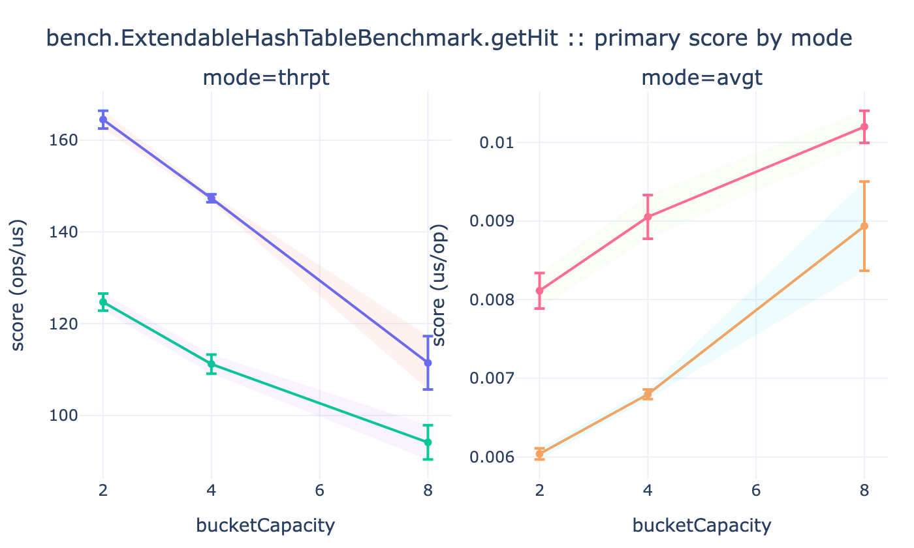

Memory collage image: 
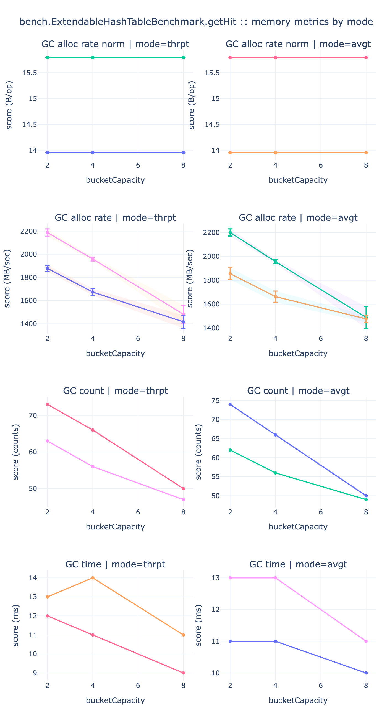

#### Notes
`getHit` замедляется при росте `n` и при увеличении `bucketCapacity`. Поиск внутри бакета линейный `indexOf`, поэтому более крупный бакет означает больше сравнений по ключам на горячем пути. Метод `get(int key)` возвращает `Integer`, а не `int`, часть маленьких значений попадает в `Integer` cache, а остальные требуют новый объект. У `getMiss` этого нет, потому что он возвращает `null`. Практически это значит добавить `int getOrDefault(int key, int defaultValue)` или аналогичный примитивный метод, а в бенчмарке работать с `int`. Второе улучшение не завышать `bucketCapacity`, потому что здесь бакет просматривается линейно и большой бакет делает hit медленнее.

### bench.ExtendableHashTableBenchmark.getMiss
Primary collage image: 
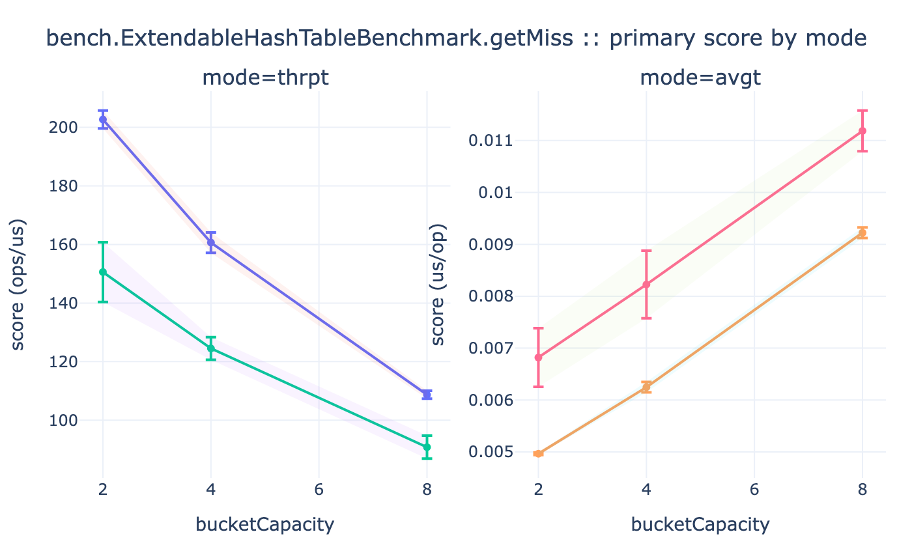

Memory collage image: 
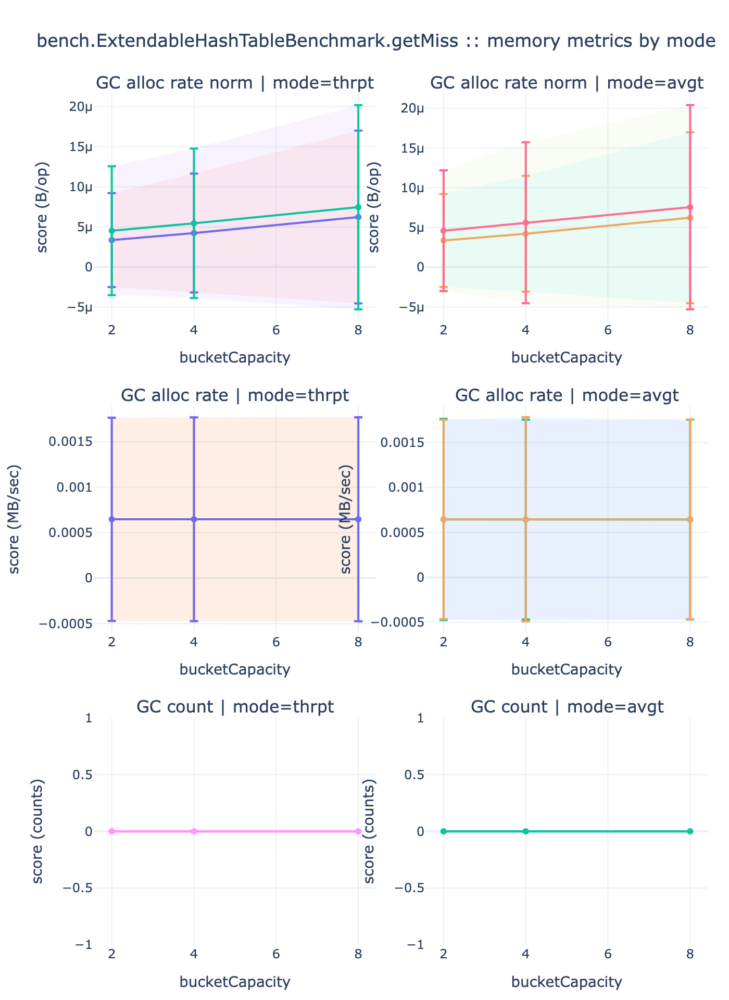

#### Notes
`getMiss` действительно быстрее `getHit` и понятно почему: miss-path не создает `Integer`, а hit-path создает. По CPU график с ростом `bucketCapacity` miss замедляется, потому что `indexOf` в худшем случае проходит по всему бакету. Самые полезные шаги здесь это оставить небольшой `bucketCapacity`, уменьшить число чтений из `MappedByteBuffer` внутри `indexOf`, а при желании хранить дополнительную краткую метку по слотам, чтобы раньше отбрасывать несовпадающие ключи без полного сравнения.

### bench.ExtendableHashTableBenchmark.putThenRemove
Primary collage image: 
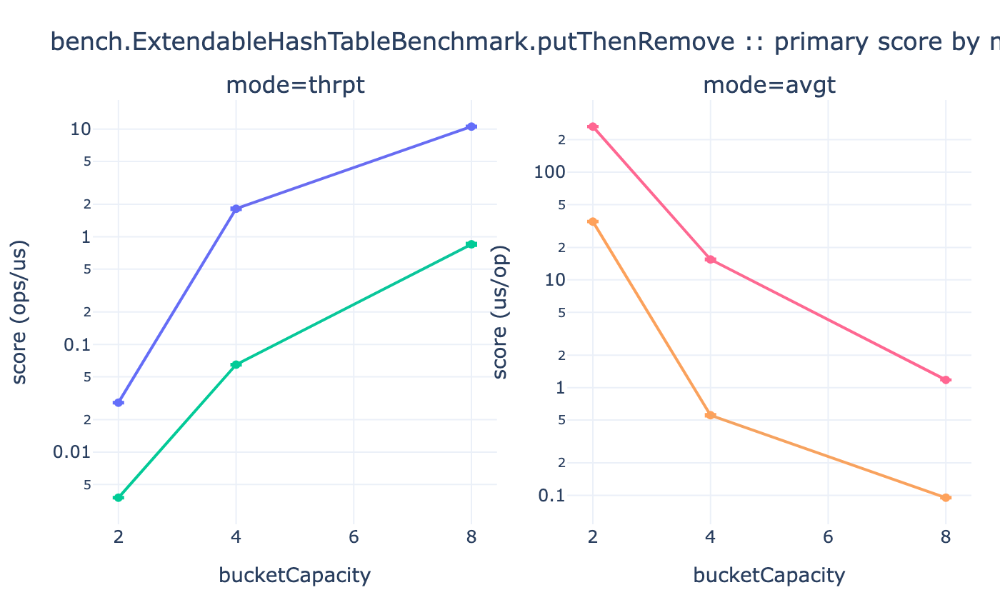

Memory collage image: 
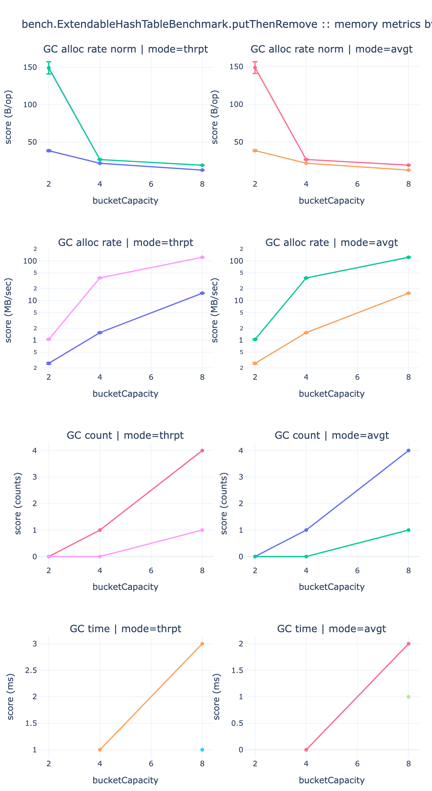

#### Notes
Операция вставить новый ключ и сразу удалить его провоцирует повторяющиеся split/merge и при `bucketCapacity=2` цена становится огромной: около 34.8 us/op при `n=1000` и уже ~265 us/op при `n=10000`.
После каждого успешного `remove()` всегда вызывается `tryMerge()`, а при следующем `put()` бакет может снова split-иться. При этом `splitBucket()` каждый раз выделяет новый бакет через append-only `allocateBucket()`, создает временные массивы `int[] keys` и `int[] values`, а освобожденный после merge бакет никак не переиспользуется, то есть файл растет даже при колебаниях вокруг одного и того же логического объема данных.

### bench.ExtendableHashTableBenchmark.removeThenPut
Primary collage image: 
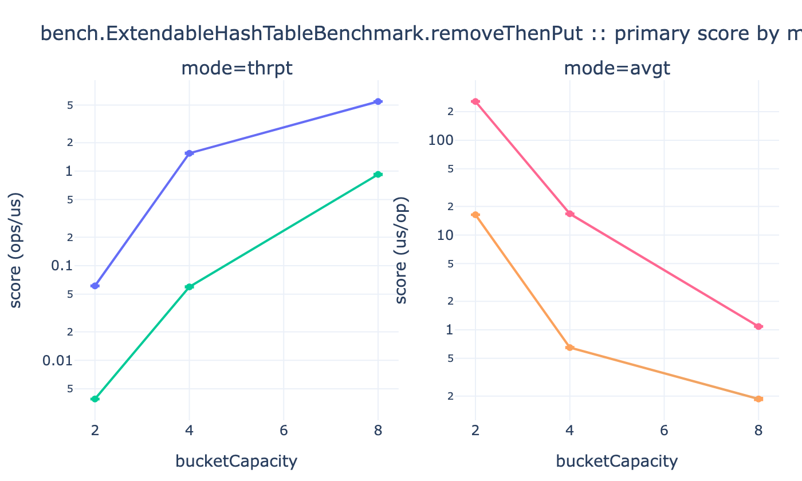

Memory collage image: 
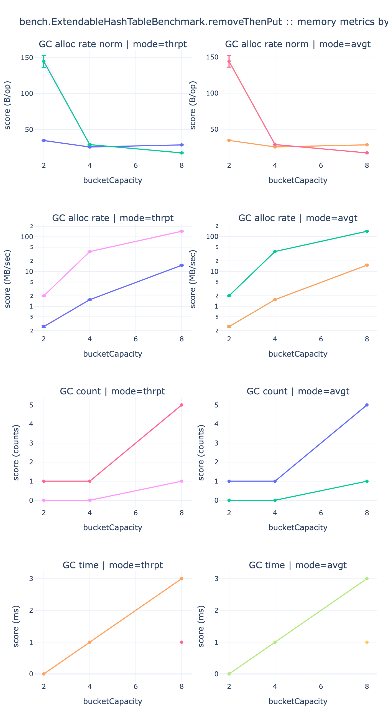

#### Notes
`removeThenPut` страдает почти от той же болезни, что и `putThenRemove`. При маленьком бакете удаление существующего ключа запускает merge, а немедленная повторная вставка часто снова приводит к split. Поэтому при `bucketCapacity=2` время уходит в десятки и сотни микросекунд на операцию вместо долей микросекунды.
Всегда после успешного удаления вызывается `tryMerge(directoryIndex)`. Для этого бенчмарка это слишком агрессивно: удалили один ключ – структура схлопнулась, сразу вернули ключ – структура снова расширилась. Дополнительно мешает то, что `globalDepth` после merge не уменьшается, а `splitBucket()` для переназначения указателей проходит по всей текущей директории.

### bench.ExtendableHashTableBenchmark.updateExisting
Primary collage image: 
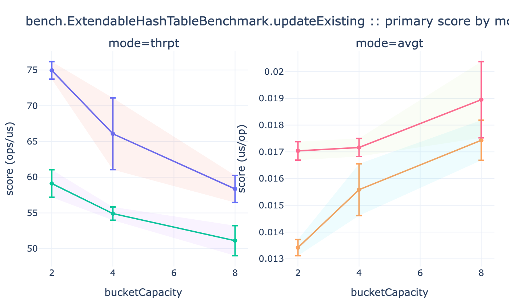

Memory collage image: 
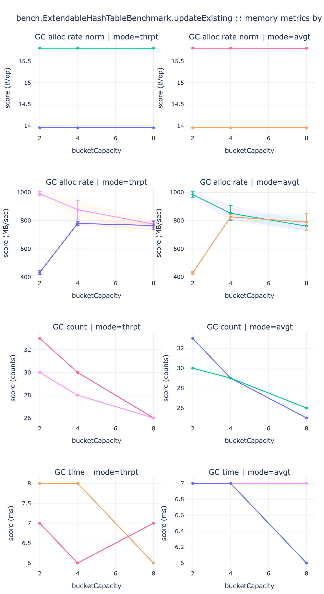

#### Notes
`updateExisting` на порядок быстрее смешанных write-операций. Алгоритм обновления здесь почти не требует правок. 

## Algorithm: LSH

### bench.LshBenchmark.addDocument
Primary collage image: 
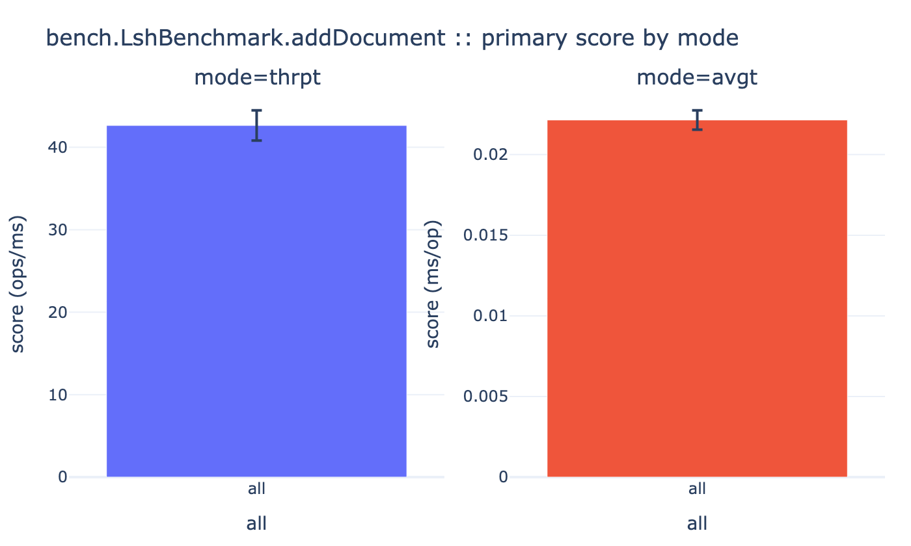

Memory collage image: 
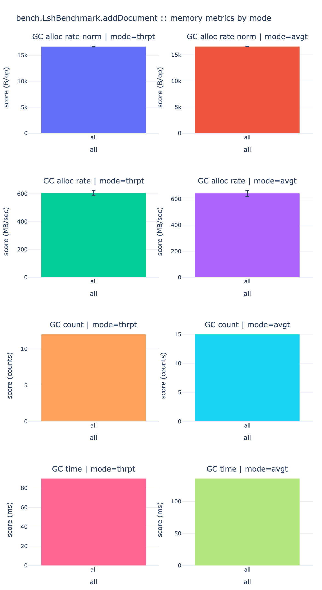

#### Notes
Операция добавления сама по себе не медленная, но довольно тяжелая по памяти, на один документ уходит около 16–17 KB временных/новых данных.
В реализации `add()` сразу делаются нормализация текста, построение множества шинглов, полная MinHash-сигнатура и запись в band-таблицы. В коде также сохраняется `docSignature`, но дальше он нигде не используется, то есть часть памяти и работы может быть лишней. Кроме того, `shinglesOf()` создает много коротких строк через `substring`, а `normalize()` дважды гоняет regex. Нужно убрать лишние аллокации.

### bench.LshBenchmark.buildIndex
Primary collage image: 
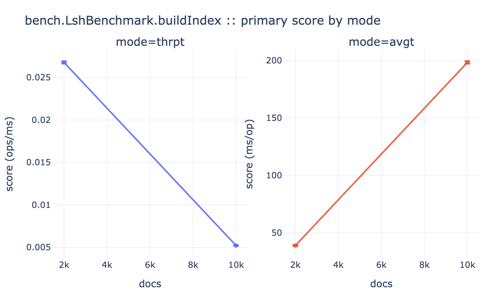

Memory collage image: 
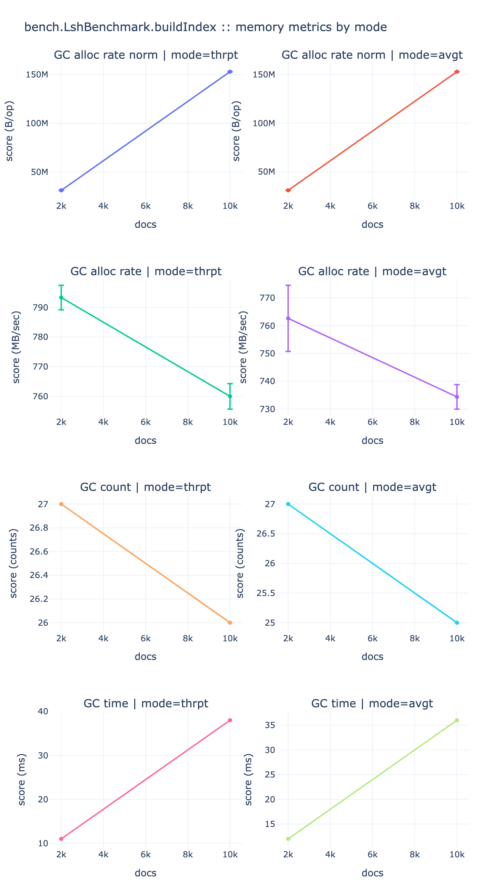

#### Notes
Время и память почти линейно растут вместе с числом документов, что для полной сборки индекса ожидаемо. Сама асимптотика здесь нормальная, но абсолютная цена высокая, потому что на каждый документ код строит шинглы, сигнатуру и обновляет все band-таблицы; кроме того, индекс хранит и `docShingles`, и `docSignature`, хотя второе в текущем коде не используется.
Стоит не хранить лишние представления документа, уменьшить число временных объектов в `shinglesOf()` и `signatureOf()`, а также перейти на примитивные структуры данных для шинглов, бакетов и списков id.

### bench.LshBenchmark.candidatesQuery
Primary collage image: 
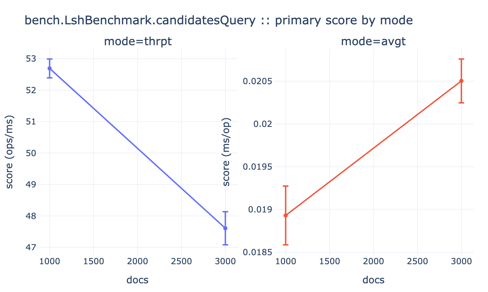

Memory collage image: 
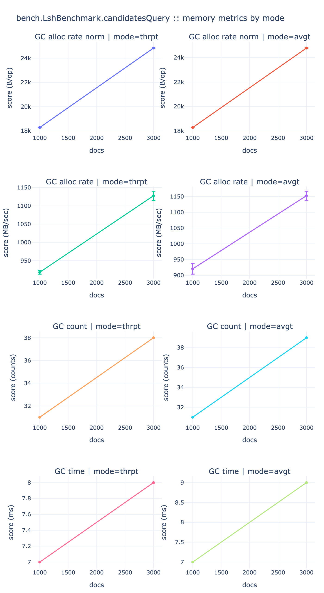

#### Notes
Быстрый по времени запрос остается довольно дорогим по памяти, потому что `candidates()` заново нормализует текст, строит шинглы, считает MinHash-сигнатуру и создает новый `HashSet<Integer>` для результата. Улучшения те же, что и ранее.

### bench.LshBenchmark.nearDuplicatesFullScan
Primary collage image: 
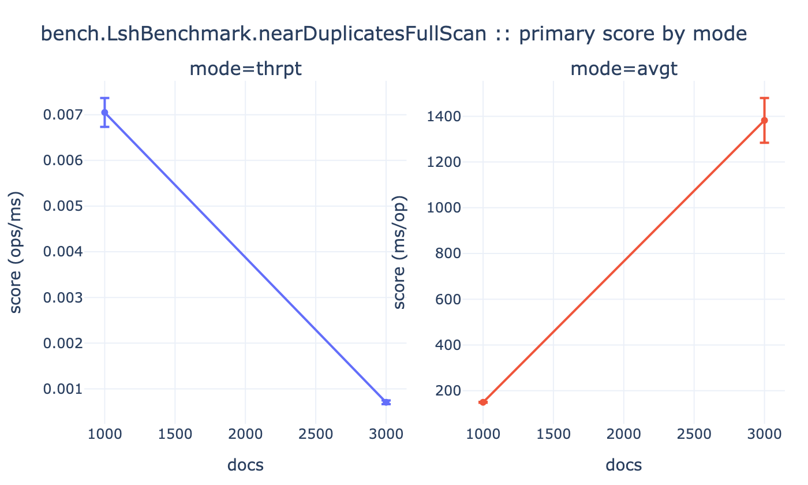

Memory collage image: 
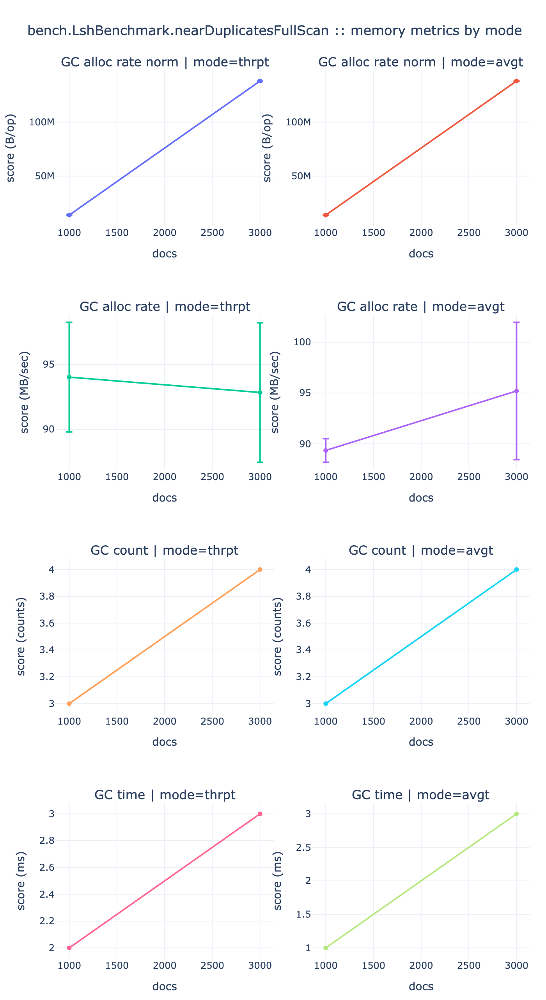

#### Notes
График показывает типичную квадратичную деградацию, где при переходе от 1000 к 3000 документам время вырастает примерно в 9 раз. Это ожидаемо для полного попарного сравнения. Метод `nearDuplicatesFullScan()` сортирует список id и затем проверяет все пары документов через точный Jaccard. Для больших наборов данных такой путь не масштабируется. Улучшение использовать LSH-кандидатов вместо полного перебора, а если точный full scan нужен как baseline, то хотя бы не пересортировывать id на каждом вызове, хранить их в готовом массиве и по возможности делать ранний выход в вычислении Jaccard при недостижимом пороге.

### bench.LshBenchmark.nearDuplicatesLsh
Primary collage image: 
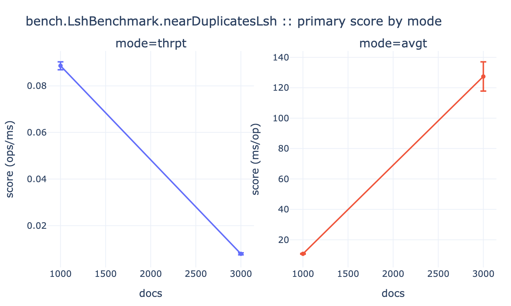

Memory collage image: 
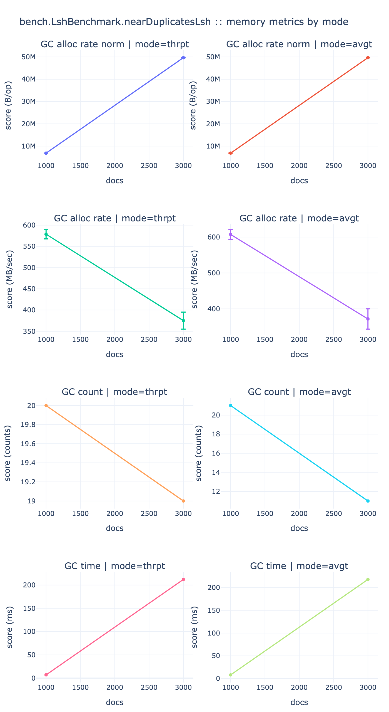

#### Notes
LSH заметно выигрывает у full scan по времени, но при росте числа документов график все равно идет вверх довольно резко. Значит фильтрация кандидатов помогает, но не убирает всю дорогую работу.
В `nearDuplicates()` код проходит по каждому бакету каждой полосы, создает массив `ids = bucket.toArray()`, генерирует все пары внутри бакета, хранит их в `seenPairs` и затем считает точный Jaccard. Если бакеты становятся большими, стоимость снова начинает быстро расти. Кроме того, сохраненный `docSignature` можно было бы использовать как дополнительный фильтр, но сейчас он не используется.

## Algorithm: Perfect Hashing

### bench.PerfectHashingBenchmark.buildIndex
Primary collage image: 
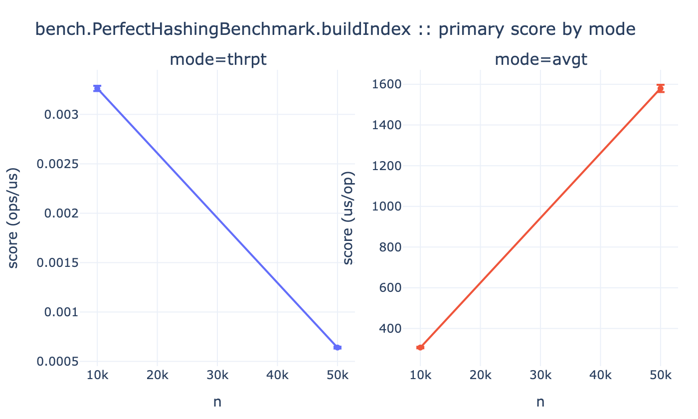

Memory collage image: 
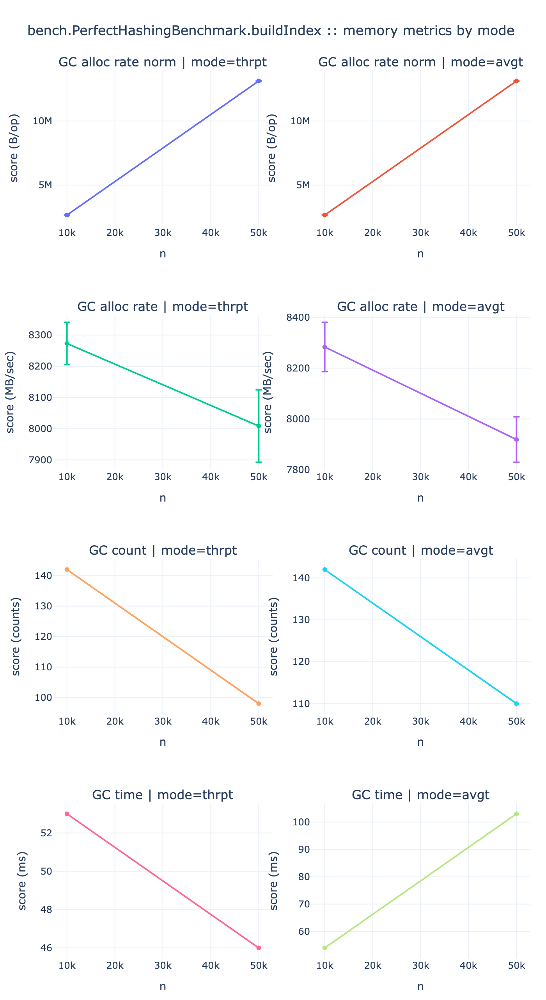

#### Notes
Построение perfect hash самая дорогая часть этой структуры. При росте `n` с 10000 до 50000 время и память растут примерно линейно.
Сначала выполняется разбиение по первому хешу, затем для каждого bucket строится вторичная таблица размера `n_j^2`, причем `h2` подбирается случайно до полного отсутствия коллизий. Каждая неудачная попытка создает новые массивы `keys/used/values`, а `validateInput()` еще и строит `HashSet` для проверки дублей.
Можно уменьшить число временных аллокаций при подборе `h2`, сделать fast-path для bucket-ов размера 0/1, переиспользовать scratch-массивы при повторных попытках, а для проверки дублей и bucket-строительства использовать более компактные примитивные структуры. 

### bench.PerfectHashingBenchmark.containsHit
Primary collage image: 
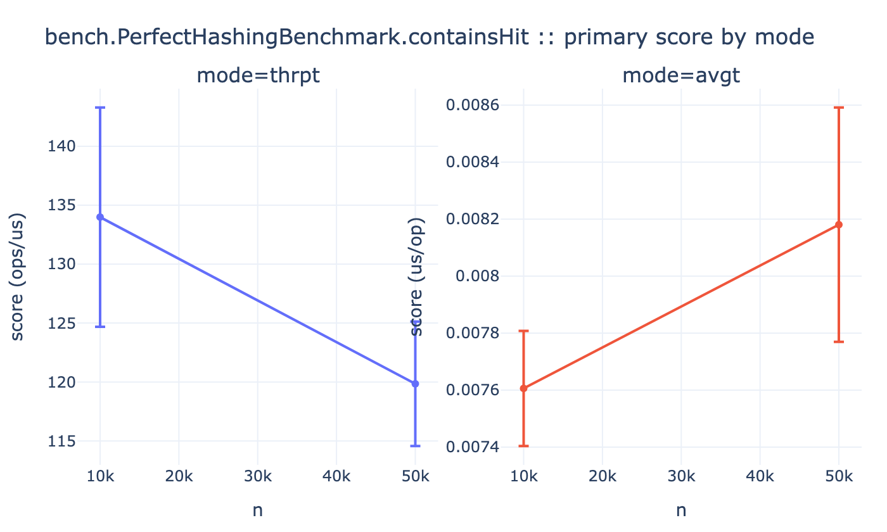

Memory collage image: 
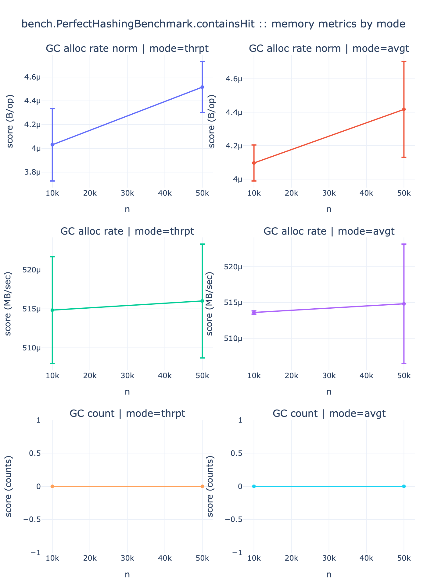

#### Notes
Чтение существующего ключа очень быстрое, почти не зависит от размера индекса и практически не аллоцирует память.

### bench.PerfectHashingBenchmark.containsMiss
Primary collage image: 
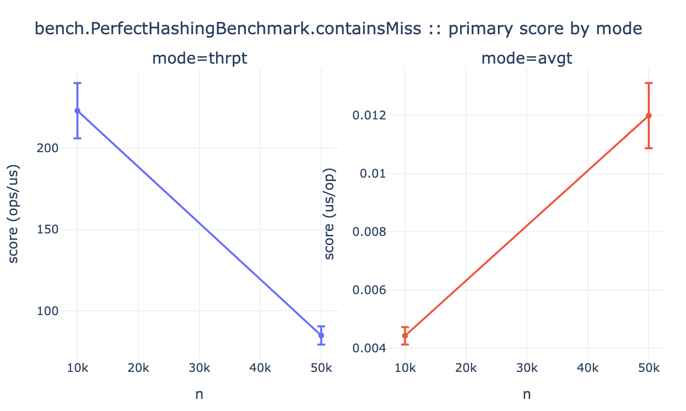

Memory collage image: 
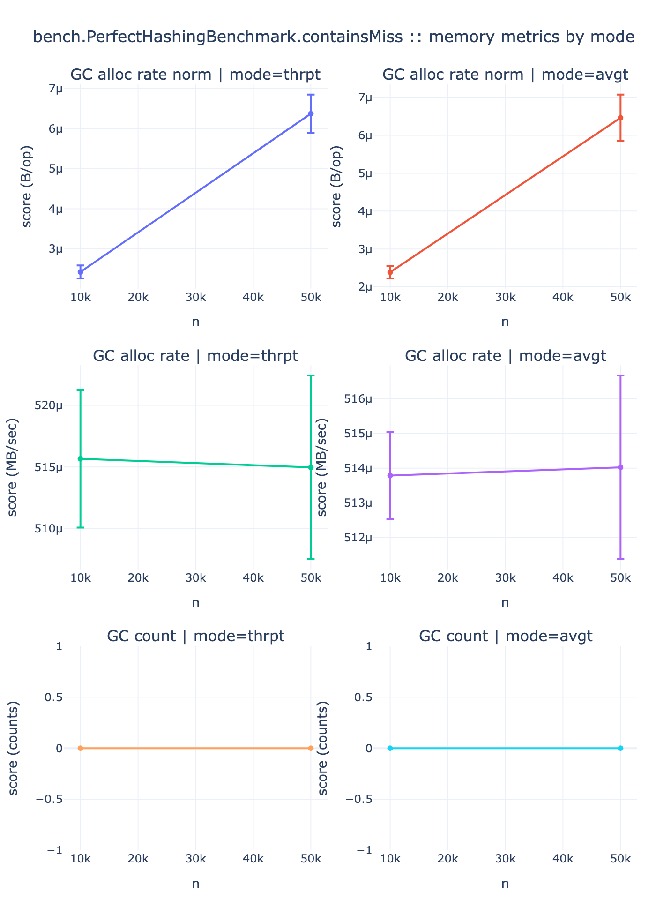

#### Notes
Проверка отсутствующего ключа тоже очень быстрая и почти безаллокционная, но на большем `n` она заметно проседает сильнее. Проблема именно в доступе к данным. Можно попробовать уплотнить метаданные (`used` через bitset вместо `boolean[]`), уменьшить число отдельных массивов на bucket. 

### bench.PerfectHashingBenchmark.getHit
Primary collage image: 
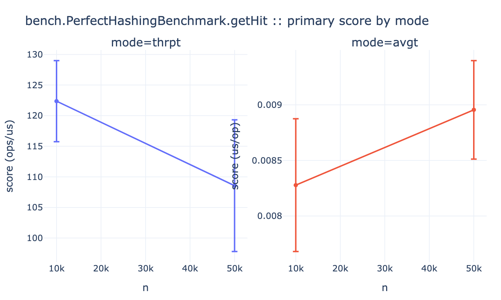

Memory collage image: 
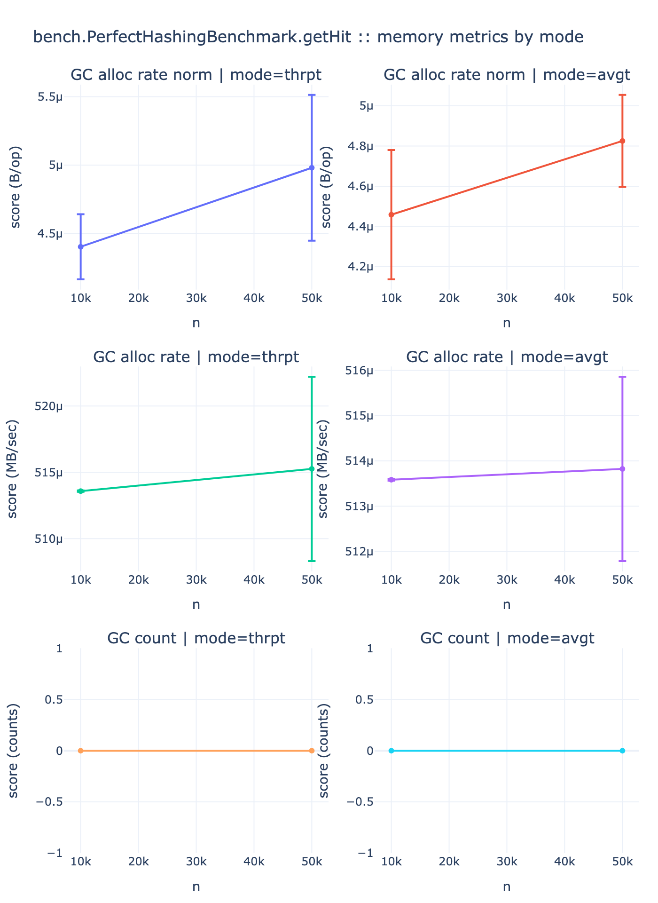

#### Notes
`getHit` стабильно быстрый и почти не меняется при росте размера индекса.

### bench.PerfectHashingBenchmark.getMiss
Primary collage image: 
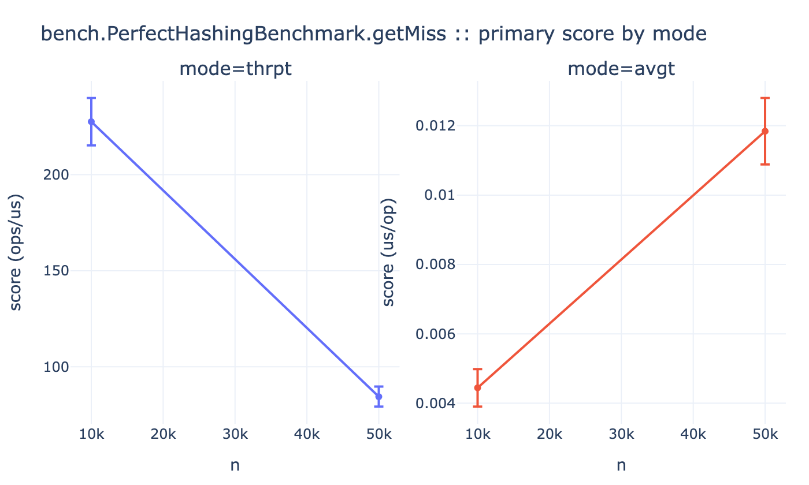

Memory collage image: 
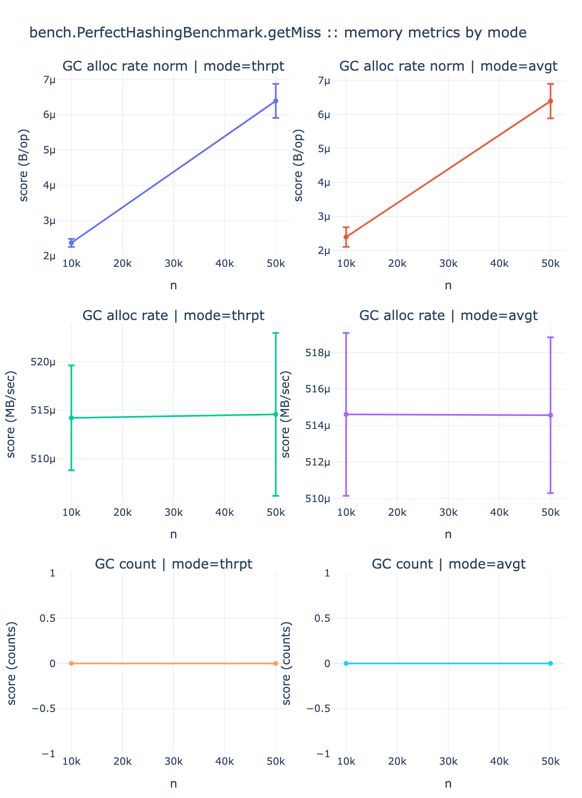

#### Notes
`getMiss` очень быстрый на `n=10000`, но на `n=50000` проседает сильнее, чем хотелось бы, но при этом он все равно остается безаллокционным. Для большой таблицы промах перестает быть дешевым по кэшу, значит оптимизировать нужно layout данных, уплотнить `used`, уменьшить число разрозненных массивов, по возможности улучшить локальность bucket-ов и проверить, не выгоднее ли хранить ключ и значение ближе друг к другу.
