## ExtendableHashTableBenchmark

### buildFromScratch

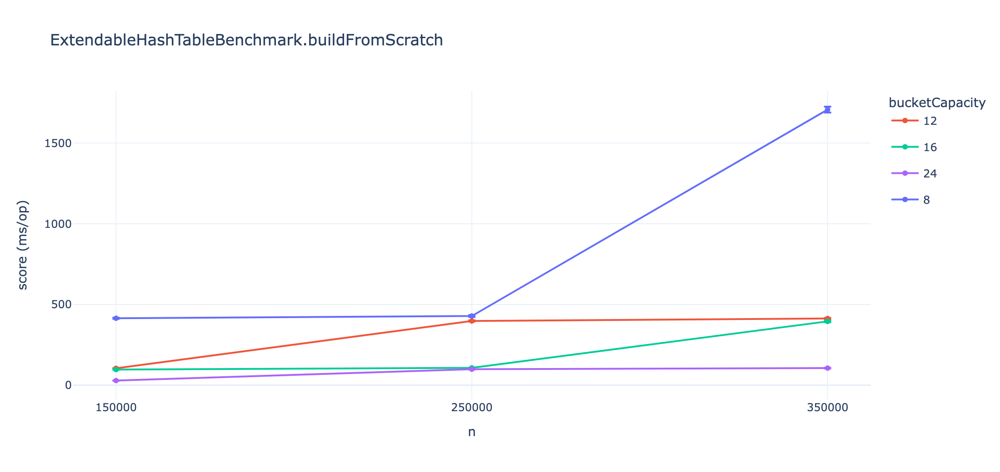

#### JMH Results
| n \ bucketCapacity | 8 | 12 | 16 | 24 |
|---|---|---|---|---|
| 150000 | 415.041125 +- 3.550409 ms/op | 104.472672 +- 0.937953 ms/op | 97.172207 +- 1.880441 ms/op | 28.778108 +- 0.537322 ms/op |
| 250000 | 428.459482 +- 5.647561 ms/op | 397.999759 +- 3.498815 ms/op | 107.360330 +- 1.727920 ms/op | 98.794182 +- 1.623424 ms/op |
| 350000 | 1707.571944 +- 18.352893 ms/op | 413.013634 +- 3.998818 ms/op | 395.377411 +- 5.485898 ms/op | 105.787625 +- 2.183931 ms/op |

#### Async Profiler Metrics by Params/Mode
**cpu_jvm_user_avg_pct**

| n \ bucketCapacity | 8 | 12 | 16 | 24 |
|---|---|---|---|---|
| 150000 | 9.950 | 9.900 | 9.900 | - |
| 250000 | 9.960 | 9.975 | 10.000 | 10.000 |
| 350000 | 9.975 | 9.975 | 9.926 | 9.802 |

**cpu_machine_total_avg_pct**

| n \ bucketCapacity | 8 | 12 | 16 | 24 |
|---|---|---|---|---|
| 150000 | 10.584 | 10.778 | 10.857 | - |
| 250000 | 15.213 | 11.200 | 10.846 | 10.778 |
| 350000 | 11.051 | 10.781 | 10.555 | 10.978 |

**cpu_samples_per_sec**

| n \ bucketCapacity | 8 | 12 | 16 | 24 |
|---|---|---|---|---|
| 150000 | 100.400 | 127.000 | 119.000 | - |
| 250000 | 103.600 | 97.000 | 137.000 | 119.000 |
| 350000 | 102.900 | 101.600 | 95.200 | 129.000 |

**alloc_events_per_sec**

| n \ bucketCapacity | 8 | 12 | 16 | 24 |
|---|---|---|---|---|
| 150000 | 15.000 | 67.000 | 64.000 | - |
| 250000 | 13.600 | 21.200 | 56.000 | 88.000 |
| 350000 | 7.750 | 19.400 | 23.800 | 72.000 |

**alloc_events_total**

| n \ bucketCapacity | 8 | 12 | 16 | 24 |
|---|---|---|---|---|
| 150000 | 75 | 67 | 64 | 40 |
| 250000 | 68 | 106 | 56 | 88 |
| 350000 | 155 | 97 | 119 | 72 |

**alloc_tlab_share_pct**

| n \ bucketCapacity | 8 | 12 | 16 | 24 |
|---|---|---|---|---|
| 150000 | 100.000 | 100.000 | 100.000 | 100.000 |
| 250000 | 100.000 | 100.000 | 100.000 | 100.000 |
| 350000 | 100.000 | 100.000 | 100.000 | 100.000 |

#### Notes
```text
На графике время построения растёт почти линейно по числу элементов, что ожидаемо, так как структура создаётся последовательными вставками, и каждая операция может приводить к разбиению бакета. Особенно заметно ухудшение при маленькой ёмкости бакета (8), потому что бакеты быстрее переполняются и чаще вызывается процедура разделения splitBucket, которая перераспределяет элементы и может удваивать директорию. В коде это видно по циклу вставки и повторному распределению ключей после split. При увеличении ёмкости бакета (24) таких операций меньше, поэтому график значительно лучше. Улучшить результат можно увеличением ёмкости бакета, использованием более равномерной хеш-функции или предварительным выделением большего размера файла, чтобы уменьшить число расширений отображённой области памяти.
```

### getHit

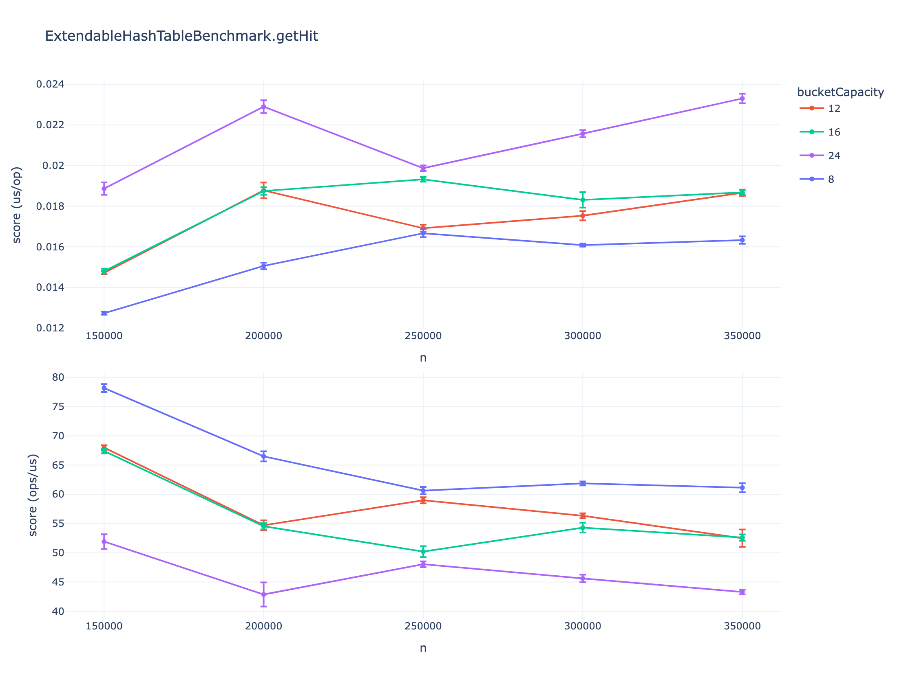

#### JMH Results
**avgt**

| n \ bucketCapacity | 8 | 12 | 16 | 24 |
|---|---|---|---|---|
| 150000 | 0.012731 +- 0.000075 us/op | 0.014720 +- 0.000080 us/op | 0.014804 +- 0.000122 us/op | 0.018865 +- 0.000305 us/op |
| 200000 | 0.015059 +- 0.000160 us/op | 0.018776 +- 0.000387 us/op | 0.018747 +- 0.000188 us/op | 0.022896 +- 0.000315 us/op |
| 250000 | 0.016667 +- 0.000194 us/op | 0.016913 +- 0.000171 us/op | 0.019319 +- 0.000112 us/op | 0.019869 +- 0.000137 us/op |
| 300000 | 0.016086 +- 0.000077 us/op | 0.017530 +- 0.000227 us/op | 0.018309 +- 0.000380 us/op | 0.021568 +- 0.000175 us/op |
| 350000 | 0.016331 +- 0.000182 us/op | 0.018657 +- 0.000156 us/op | 0.018680 +- 0.000121 us/op | 0.023299 +- 0.000232 us/op |

**thrpt**

| n \ bucketCapacity | 8 | 12 | 16 | 24 |
|---|---|---|---|---|
| 150000 | 78.171046 +- 0.691340 ops/us | 67.982520 +- 0.415371 ops/us | 67.406466 +- 0.403357 ops/us | 51.910090 +- 1.258601 ops/us |
| 200000 | 66.486439 +- 0.856808 ops/us | 54.700580 +- 0.850975 ops/us | 54.540016 +- 0.541183 ops/us | 42.867363 +- 2.058395 ops/us |
| 250000 | 60.636428 +- 0.613696 ops/us | 58.977120 +- 0.523777 ops/us | 50.196242 +- 0.931974 ops/us | 48.034726 +- 0.490253 ops/us |
| 300000 | 61.858753 +- 0.341292 ops/us | 56.329150 +- 0.415366 ops/us | 54.297320 +- 0.842603 ops/us | 45.603461 +- 0.645559 ops/us |
| 350000 | 61.128880 +- 0.772624 ops/us | 52.486613 +- 1.487226 ops/us | 52.603109 +- 0.548279 ops/us | 43.284937 +- 0.388007 ops/us |

#### Async Profiler Metrics by Params/Mode
**cpu_jvm_user_avg_pct**

| n \ bucketCapacity | 8 | 12 | 16 | 24 |
|---|---|---|---|---|
| 150000 | 10.000 | 9.998 | 9.996 | 9.998 |
| 200000 | 9.996 | 9.998 | 9.981 | 9.994 |
| 250000 | 10.000 | 9.998 | 9.998 | 9.987 |
| 300000 | 10.000 | 10.000 | 10.004 | 9.985 |
| 350000 | 10.002 | 10.004 | 9.981 | 10.000 |

**cpu_machine_total_avg_pct**

| n \ bucketCapacity | 8 | 12 | 16 | 24 |
|---|---|---|---|---|
| 150000 | 10.621 | 10.668 | 10.531 | 10.542 |
| 200000 | 10.880 | 10.894 | 11.657 | 12.353 |
| 250000 | 10.845 | 10.485 | 10.517 | 12.838 |
| 300000 | 10.511 | 10.520 | 10.565 | 13.501 |
| 350000 | 10.625 | 10.676 | 11.585 | 10.620 |

**cpu_samples_per_sec**

| n \ bucketCapacity | 8 | 12 | 16 | 24 |
|---|---|---|---|---|
| 150000 | 101.875 | 102.542 | 101.979 | 101.583 |
| 200000 | 102.062 | 102.771 | 102.396 | 101.708 |
| 250000 | 102.833 | 102.708 | 101.938 | 102.188 |
| 300000 | 102.646 | 102.479 | 101.917 | 101.062 |
| 350000 | 102.438 | 101.938 | 101.771 | 101.208 |

**alloc_events_per_sec**

| n \ bucketCapacity | 8 | 12 | 16 | 24 |
|---|---|---|---|---|
| 150000 | 2409.562 | 2086.333 | 2070.750 | 1568.021 |
| 200000 | 1977.729 | 1669.104 | 1633.708 | 1338.625 |
| 250000 | 1863.604 | 1832.583 | 1572.271 | 1528.188 |
| 300000 | 1881.542 | 1686.229 | 1710.000 | 1424.354 |
| 350000 | 1864.354 | 1652.750 | 1627.250 | 1332.812 |

**alloc_events_total**

| n \ bucketCapacity | 8 | 12 | 16 | 24 |
|---|---|---|---|---|
| 150000 | 57830 | 50072 | 49698 | 37632 |
| 200000 | 47466 | 40058 | 39209 | 32127 |
| 250000 | 44726 | 43982 | 37734 | 36676 |
| 300000 | 45157 | 40470 | 41040 | 34184 |
| 350000 | 44744 | 39666 | 39054 | 31988 |

**alloc_tlab_share_pct**

| n \ bucketCapacity | 8 | 12 | 16 | 24 |
|---|---|---|---|---|
| 150000 | 100.000 | 100.000 | 100.000 | 100.000 |
| 200000 | 100.000 | 100.000 | 100.000 | 100.000 |
| 250000 | 100.000 | 100.000 | 100.000 | 100.000 |
| 300000 | 100.000 | 100.000 | 100.000 | 100.000 |
| 350000 | 100.000 | 100.000 | 100.000 | 100.000 |

#### Notes
```text
Время чтения существующего ключа практически не зависит от числа элементов и находится на уровне нескольких наносекунд, что соответствует ожидаемой сложности O(1). Это объясняется тем, что алгоритм вычисляет индекс директории, затем читает один бакет и выполняет короткий линейный поиск внутри него. В коде это видно в методе get, где происходит вычисление индекса и поиск внутри бакета через indexOf. Небольшие колебания между конфигурациями объясняются различным размером бакета и длиной внутреннего перебора. Улучшить результат можно уменьшением размера бакетов или использованием более компактного хранения записей.
```

### getMiss

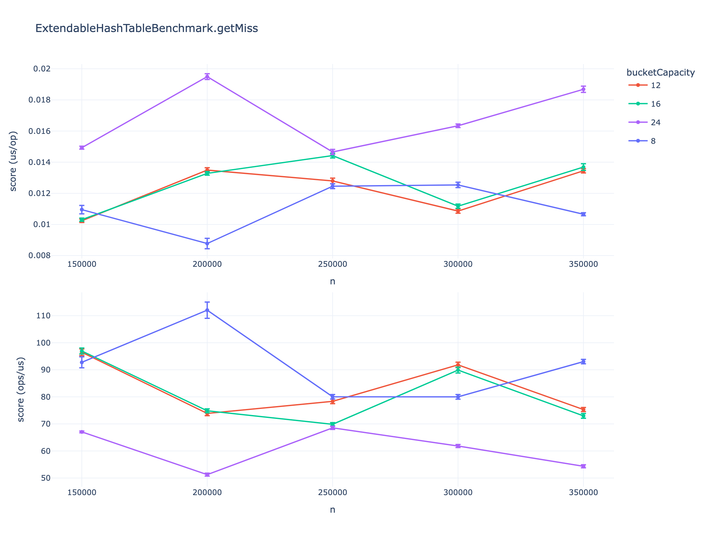

#### JMH Results
**avgt**

| n \ bucketCapacity | 8 | 12 | 16 | 24 |
|---|---|---|---|---|
| 150000 | 0.010952 +- 0.000268 us/op | 0.010235 +- 0.000109 us/op | 0.010306 +- 0.000105 us/op | 0.014932 +- 0.000094 us/op |
| 200000 | 0.008774 +- 0.000336 us/op | 0.013492 +- 0.000151 us/op | 0.013282 +- 0.000116 us/op | 0.019496 +- 0.000184 us/op |
| 250000 | 0.012458 +- 0.000157 us/op | 0.012794 +- 0.000182 us/op | 0.014424 +- 0.000152 us/op | 0.014656 +- 0.000164 us/op |
| 300000 | 0.012539 +- 0.000172 us/op | 0.010860 +- 0.000136 us/op | 0.011173 +- 0.000136 us/op | 0.016340 +- 0.000112 us/op |
| 350000 | 0.010654 +- 0.000098 us/op | 0.013447 +- 0.000138 us/op | 0.013686 +- 0.000212 us/op | 0.018682 +- 0.000201 us/op |

**thrpt**

| n \ bucketCapacity | 8 | 12 | 16 | 24 |
|---|---|---|---|---|
| 150000 | 92.759930 +- 2.031377 ops/us | 96.477282 +- 1.248091 ops/us | 96.955446 +- 1.092503 ops/us | 67.046205 +- 0.322654 ops/us |
| 200000 | 112.044686 +- 3.001561 ops/us | 73.879452 +- 0.845637 ops/us | 74.843087 +- 0.724084 ops/us | 51.251525 +- 0.552279 ops/us |
| 250000 | 80.027653 +- 0.838118 ops/us | 78.342261 +- 0.860089 ops/us | 69.860824 +- 0.600868 ops/us | 68.538181 +- 0.585094 ops/us |
| 300000 | 79.998128 +- 0.857148 ops/us | 91.820801 +- 0.979034 ops/us | 89.898509 +- 1.086581 ops/us | 61.820592 +- 0.558823 ops/us |
| 350000 | 93.025755 +- 0.813550 ops/us | 75.301927 +- 0.750118 ops/us | 72.976851 +- 0.878229 ops/us | 54.349590 +- 0.556493 ops/us |

#### Async Profiler Metrics by Params/Mode
**cpu_jvm_user_avg_pct**

| n \ bucketCapacity | 8 | 12 | 16 | 24 |
|---|---|---|---|---|
| 150000 | 9.989 | 9.994 | 9.996 | 9.991 |
| 200000 | 9.991 | 9.996 | 9.994 | 9.996 |
| 250000 | 9.989 | 9.991 | 9.994 | 9.991 |
| 300000 | 9.989 | 9.989 | 9.991 | 9.996 |
| 350000 | 9.994 | 9.994 | 9.998 | 9.994 |

**cpu_machine_total_avg_pct**

| n \ bucketCapacity | 8 | 12 | 16 | 24 |
|---|---|---|---|---|
| 150000 | 11.405 | 10.458 | 10.486 | 10.862 |
| 200000 | 10.496 | 10.475 | 10.761 | 10.545 |
| 250000 | 10.935 | 11.080 | 10.477 | 10.652 |
| 300000 | 10.956 | 10.832 | 10.754 | 10.553 |
| 350000 | 10.636 | 10.738 | 10.487 | 11.037 |

**cpu_samples_per_sec**

| n \ bucketCapacity | 8 | 12 | 16 | 24 |
|---|---|---|---|---|
| 150000 | 102.271 | 102.521 | 102.354 | 102.229 |
| 200000 | 102.500 | 102.250 | 102.917 | 102.438 |
| 250000 | 102.583 | 102.583 | 102.688 | 102.333 |
| 300000 | 102.604 | 102.396 | 102.812 | 102.375 |
| 350000 | 102.917 | 102.229 | 103.000 | 102.875 |

**alloc_events_per_sec**

| n \ bucketCapacity | 8 | 12 | 16 | 24 |
|---|---|---|---|---|
| 150000 | 0.021 | 0.042 | 0.042 | 0.042 |
| 200000 | 0.104 | 0.000 | 0.042 | 0.083 |
| 250000 | 0.167 | 0.042 | 0.042 | 0.062 |
| 300000 | 0.083 | 0.062 | 0.062 | 0.042 |
| 350000 | 0.021 | 0.083 | 0.062 | 0.042 |

**alloc_events_total**

| n \ bucketCapacity | 8 | 12 | 16 | 24 |
|---|---|---|---|---|
| 150000 | 0 | 1 | 1 | 1 |
| 200000 | 2 | 0 | 1 | 2 |
| 250000 | 4 | 1 | 1 | 2 |
| 300000 | 2 | 2 | 2 | 1 |
| 350000 | 0 | 2 | 2 | 1 |

**alloc_tlab_share_pct**

| n \ bucketCapacity | 8 | 12 | 16 | 24 |
|---|---|---|---|---|
| 150000 | 100.000 | 100.000 | 100.000 | 100.000 |
| 200000 | 100.000 | - | 100.000 | 100.000 |
| 250000 | 100.000 | 100.000 | 100.000 | 100.000 |
| 300000 | 100.000 | 100.000 | 100.000 | 100.000 |
| 350000 | 100.000 | 100.000 | 100.000 | 100.000 |

#### Notes
```text
Поведение очень похоже на предыдущий тест, но время немного меньше, потому что при отсутствии ключа поиск часто заканчивается раньше. Метод indexOf просто проходит по записям бакета и не находит совпадения. Поскольку размер бакета ограничен, сложность остаётся постоянной. Разброс значений связан с различным количеством элементов в бакетах из-за распределения хеша. Улучшить ситуацию можно более равномерной хеш-функцией или уменьшением ёмкости бакетов.
```

### putThenRemove

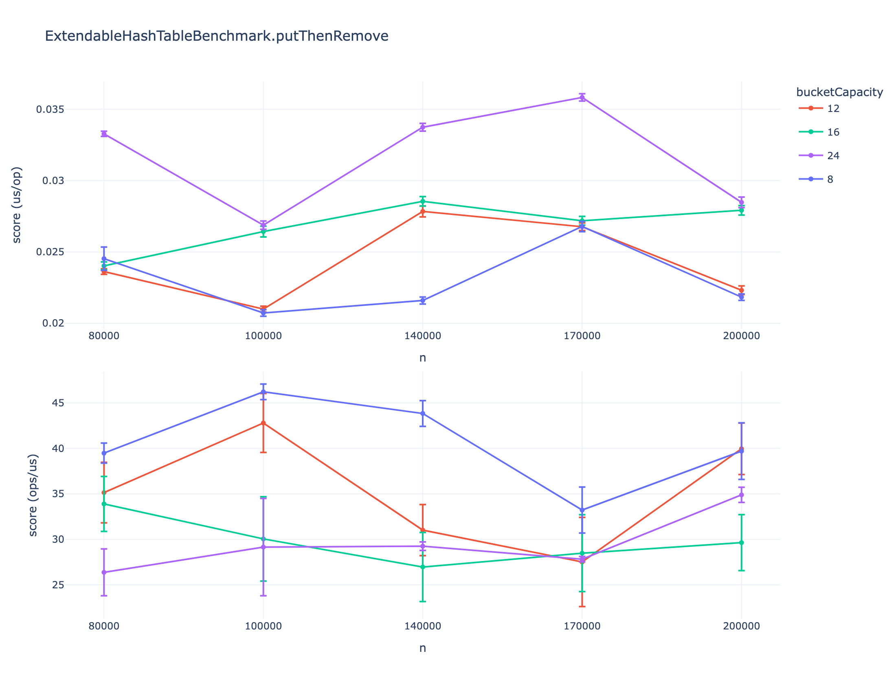

#### JMH Results
**avgt**

| n \ bucketCapacity | 8 | 12 | 16 | 24 |
|---|---|---|---|---|
| 80000 | 0.024528 +- 0.000817 us/op | 0.023622 +- 0.000191 us/op | 0.024026 +- 0.000277 us/op | 0.033275 +- 0.000181 us/op |
| 100000 | 0.020723 +- 0.000233 us/op | 0.020995 +- 0.000208 us/op | 0.026427 +- 0.000379 us/op | 0.026874 +- 0.000294 us/op |
| 140000 | 0.021596 +- 0.000249 us/op | 0.027839 +- 0.000386 us/op | 0.028542 +- 0.000335 us/op | 0.033738 +- 0.000270 us/op |
| 170000 | 0.026782 +- 0.000361 us/op | 0.026766 +- 0.000267 us/op | 0.027185 +- 0.000307 us/op | 0.035824 +- 0.000254 us/op |
| 200000 | 0.021833 +- 0.000224 us/op | 0.022314 +- 0.000301 us/op | 0.027915 +- 0.000332 us/op | 0.028473 +- 0.000371 us/op |

**thrpt**

| n \ bucketCapacity | 8 | 12 | 16 | 24 |
|---|---|---|---|---|
| 80000 | 39.478103 +- 1.101628 ops/us | 35.140417 +- 3.329091 ops/us | 33.892159 +- 3.021391 ops/us | 26.375403 +- 2.574361 ops/us |
| 100000 | 46.212311 +- 0.860162 ops/us | 42.785559 +- 3.237285 ops/us | 30.051106 +- 4.630758 ops/us | 29.151008 +- 5.341524 ops/us |
| 140000 | 43.833611 +- 1.414088 ops/us | 31.018399 +- 2.809745 ops/us | 26.965055 +- 3.800620 ops/us | 29.249738 +- 0.469537 ops/us |
| 170000 | 33.225785 +- 2.527878 ops/us | 27.523694 +- 4.898801 ops/us | 28.483991 +- 4.224055 ops/us | 27.824707 +- 0.295736 ops/us |
| 200000 | 39.698183 +- 3.107839 ops/us | 39.956055 +- 2.834436 ops/us | 29.643680 +- 3.075295 ops/us | 34.891776 +- 0.834407 ops/us |

#### Async Profiler Metrics by Params/Mode
**cpu_jvm_user_avg_pct**

| n \ bucketCapacity | 8 | 12 | 16 | 24 |
|---|---|---|---|---|
| 80000 | 9.907 | 9.922 | 9.907 | 9.935 |
| 100000 | 9.935 | 9.927 | 9.801 | 9.979 |
| 140000 | 9.961 | 9.918 | 9.872 | 9.981 |
| 170000 | 9.833 | 9.885 | 9.862 | 9.991 |
| 200000 | 9.927 | 9.937 | 9.898 | 9.981 |

**cpu_machine_total_avg_pct**

| n \ bucketCapacity | 8 | 12 | 16 | 24 |
|---|---|---|---|---|
| 80000 | 29.675 | 29.680 | 27.641 | 29.270 |
| 100000 | 26.229 | 28.359 | 32.368 | 16.988 |
| 140000 | 25.991 | 27.623 | 28.915 | 13.853 |
| 170000 | 30.250 | 28.901 | 28.835 | 12.055 |
| 200000 | 29.100 | 27.728 | 28.946 | 13.626 |

**cpu_samples_per_sec**

| n \ bucketCapacity | 8 | 12 | 16 | 24 |
|---|---|---|---|---|
| 80000 | 100.896 | 101.292 | 101.479 | 101.542 |
| 100000 | 100.792 | 101.625 | 101.229 | 101.312 |
| 140000 | 100.875 | 101.146 | 101.396 | 101.229 |
| 170000 | 100.938 | 101.417 | 101.458 | 101.521 |
| 200000 | 101.771 | 101.438 | 101.417 | 101.979 |

**alloc_events_per_sec**

| n \ bucketCapacity | 8 | 12 | 16 | 24 |
|---|---|---|---|---|
| 80000 | 0.042 | 0.042 | 0.000 | 0.021 |
| 100000 | 0.000 | 0.062 | 0.021 | 0.062 |
| 140000 | 0.000 | 0.000 | 0.042 | 0.083 |
| 170000 | 0.062 | 0.062 | 0.062 | 0.042 |
| 200000 | 0.000 | 0.021 | 0.042 | 0.021 |

**alloc_events_total**

| n \ bucketCapacity | 8 | 12 | 16 | 24 |
|---|---|---|---|---|
| 80000 | 1 | 1 | 0 | 0 |
| 100000 | 0 | 2 | 0 | 2 |
| 140000 | 0 | 0 | 1 | 2 |
| 170000 | 2 | 2 | 2 | 1 |
| 200000 | 0 | 0 | 1 | 0 |

**alloc_tlab_share_pct**

| n \ bucketCapacity | 8 | 12 | 16 | 24 |
|---|---|---|---|---|
| 80000 | 100.000 | 100.000 | - | 100.000 |
| 100000 | - | 100.000 | 100.000 | 100.000 |
| 140000 | - | - | 100.000 | 100.000 |
| 170000 | 100.000 | 100.000 | 100.000 | 100.000 |
| 200000 | - | 100.000 | 100.000 | 100.000 |

#### Notes
```text
На графике видно почти постоянное время операции независимо от размера структуры. Это ожидаемо, потому что операция вставки выполняется в одном бакете, а затем удаление просто заменяет удаляемый элемент последним и уменьшает размер бакета. В коде это реализовано через put и remove, где удаление выполняется без перераспределения элементов. Основная стоимость операции — вычисление хеша и запись в память. Незначительные колебания объясняются случайным распределением ключей и возможными разделениями бакетов при вставке. Улучшить можно уменьшением количества split-операций за счёт увеличения бакетов.
```

### removeThenPut

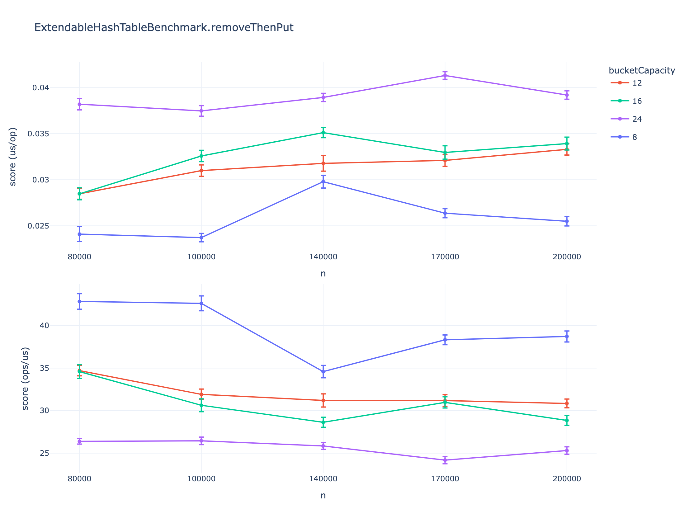

#### JMH Results
**avgt**

| n \ bucketCapacity | 8 | 12 | 16 | 24 |
|---|---|---|---|---|
| 80000 | 0.024095 +- 0.000811 us/op | 0.028469 +- 0.000592 us/op | 0.028468 +- 0.000650 us/op | 0.038197 +- 0.000615 us/op |
| 100000 | 0.023710 +- 0.000457 us/op | 0.030990 +- 0.000615 us/op | 0.032577 +- 0.000615 us/op | 0.037469 +- 0.000575 us/op |
| 140000 | 0.029787 +- 0.000696 us/op | 0.031774 +- 0.000847 us/op | 0.035110 +- 0.000544 us/op | 0.038932 +- 0.000448 us/op |
| 170000 | 0.026361 +- 0.000497 us/op | 0.032095 +- 0.000644 us/op | 0.032958 +- 0.000723 us/op | 0.041313 +- 0.000414 us/op |
| 200000 | 0.025489 +- 0.000509 us/op | 0.033299 +- 0.000617 us/op | 0.033925 +- 0.000697 us/op | 0.039195 +- 0.000454 us/op |

**thrpt**

| n \ bucketCapacity | 8 | 12 | 16 | 24 |
|---|---|---|---|---|
| 80000 | 42.834967 +- 0.917945 ops/us | 34.702852 +- 0.611613 ops/us | 34.586895 +- 0.810273 ops/us | 26.393442 +- 0.321916 ops/us |
| 100000 | 42.608017 +- 0.874632 ops/us | 31.911589 +- 0.625907 ops/us | 30.630608 +- 0.755960 ops/us | 26.450727 +- 0.446063 ops/us |
| 140000 | 34.586607 +- 0.727597 ops/us | 31.199198 +- 0.774733 ops/us | 28.635369 +- 0.590736 ops/us | 25.848468 +- 0.394394 ops/us |
| 170000 | 38.323209 +- 0.573563 ops/us | 31.187040 +- 0.679129 ops/us | 30.971629 +- 0.662059 ops/us | 24.188842 +- 0.428229 ops/us |
| 200000 | 38.715334 +- 0.642750 ops/us | 30.848421 +- 0.515761 ops/us | 28.853255 +- 0.578309 ops/us | 25.315258 +- 0.434205 ops/us |

#### Async Profiler Metrics by Params/Mode
**cpu_jvm_user_avg_pct**

| n \ bucketCapacity | 8 | 12 | 16 | 24 |
|---|---|---|---|---|
| 80000 | 9.989 | 9.989 | 9.987 | 9.994 |
| 100000 | 9.996 | 9.991 | 9.994 | 9.983 |
| 140000 | 9.990 | 9.994 | 9.989 | 9.989 |
| 170000 | 9.992 | 9.991 | 9.989 | 9.991 |
| 200000 | 9.992 | 9.994 | 9.998 | 9.987 |

**cpu_machine_total_avg_pct**

| n \ bucketCapacity | 8 | 12 | 16 | 24 |
|---|---|---|---|---|
| 80000 | 10.795 | 10.653 | 10.944 | 10.885 |
| 100000 | 10.916 | 10.825 | 10.788 | 11.603 |
| 140000 | 11.137 | 10.617 | 11.342 | 10.913 |
| 170000 | 11.218 | 10.734 | 11.061 | 10.688 |
| 200000 | 10.799 | 10.758 | 10.953 | 10.938 |

**cpu_samples_per_sec**

| n \ bucketCapacity | 8 | 12 | 16 | 24 |
|---|---|---|---|---|
| 80000 | 101.542 | 101.583 | 101.729 | 101.750 |
| 100000 | 100.854 | 101.500 | 100.729 | 101.896 |
| 140000 | 100.979 | 101.708 | 100.917 | 101.729 |
| 170000 | 100.979 | 102.646 | 101.104 | 101.521 |
| 200000 | 101.083 | 101.250 | 101.250 | 101.500 |

**alloc_events_per_sec**

| n \ bucketCapacity | 8 | 12 | 16 | 24 |
|---|---|---|---|---|
| 80000 | 0.000 | 0.000 | 0.000 | 0.021 |
| 100000 | 0.062 | 0.000 | 0.021 | 0.042 |
| 140000 | 0.021 | 0.042 | 0.042 | 0.021 |
| 170000 | 0.083 | 0.042 | 0.000 | 0.062 |
| 200000 | 0.104 | 0.104 | 0.083 | 0.021 |

**alloc_events_total**

| n \ bucketCapacity | 8 | 12 | 16 | 24 |
|---|---|---|---|---|
| 80000 | 0 | 0 | 0 | 0 |
| 100000 | 2 | 0 | 0 | 1 |
| 140000 | 0 | 1 | 1 | 0 |
| 170000 | 2 | 1 | 0 | 2 |
| 200000 | 2 | 2 | 2 | 0 |

**alloc_tlab_share_pct**

| n \ bucketCapacity | 8 | 12 | 16 | 24 |
|---|---|---|---|---|
| 80000 | - | - | - | 100.000 |
| 100000 | 100.000 | - | 100.000 | 100.000 |
| 140000 | 100.000 | 100.000 | 100.000 | 100.000 |
| 170000 | 100.000 | 100.000 | - | 100.000 |
| 200000 | 100.000 | 100.000 | 100.000 | 100.000 |

#### Notes
```text
График почти симметричен предыдущему тесту, потому что операции выполняются в обратном порядке, но имеют похожую стоимость. Удаление работает через замену последним элементом, а последующая вставка выполняется через обычную процедуру put. В некоторых точках наблюдается небольшое увеличение времени из-за возможного разделения бакета при повторной вставке. Это видно в коде, где при переполнении бакета вызывается splitBucket. Улучшить поведение можно снижением вероятности переполнения бакетов.
```

### updateExisting

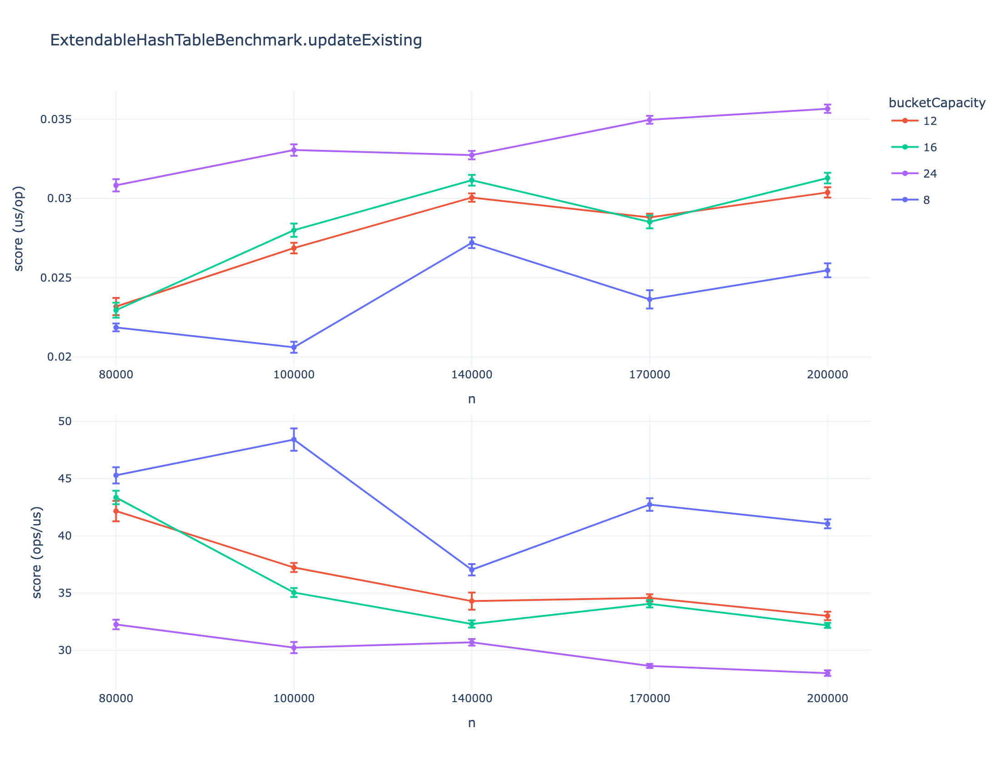

#### JMH Results
**avgt**

| n \ bucketCapacity | 8 | 12 | 16 | 24 |
|---|---|---|---|---|
| 80000 | 0.021866 +- 0.000249 us/op | 0.023182 +- 0.000546 us/op | 0.022952 +- 0.000469 us/op | 0.030830 +- 0.000386 us/op |
| 100000 | 0.020611 +- 0.000347 us/op | 0.026872 +- 0.000337 us/op | 0.027997 +- 0.000421 us/op | 0.033055 +- 0.000364 us/op |
| 140000 | 0.027205 +- 0.000338 us/op | 0.030059 +- 0.000265 us/op | 0.031149 +- 0.000339 us/op | 0.032737 +- 0.000266 us/op |
| 170000 | 0.023637 +- 0.000578 us/op | 0.028805 +- 0.000236 us/op | 0.028521 +- 0.000406 us/op | 0.034962 +- 0.000251 us/op |
| 200000 | 0.025467 +- 0.000440 us/op | 0.030382 +- 0.000329 us/op | 0.031287 +- 0.000332 us/op | 0.035660 +- 0.000259 us/op |

**thrpt**

| n \ bucketCapacity | 8 | 12 | 16 | 24 |
|---|---|---|---|---|
| 80000 | 45.282823 +- 0.710296 ops/us | 42.164834 +- 0.892977 ops/us | 43.346427 +- 0.588149 ops/us | 32.256453 +- 0.416294 ops/us |
| 100000 | 48.406932 +- 0.977462 ops/us | 37.231159 +- 0.394984 ops/us | 35.046144 +- 0.395519 ops/us | 30.236164 +- 0.491775 ops/us |
| 140000 | 37.035337 +- 0.496258 ops/us | 34.294373 +- 0.749852 ops/us | 32.298725 +- 0.312842 ops/us | 30.697560 +- 0.285272 ops/us |
| 170000 | 42.727787 +- 0.550643 ops/us | 34.572671 +- 0.316968 ops/us | 34.063533 +- 0.320606 ops/us | 28.634000 +- 0.176648 ops/us |
| 200000 | 41.047921 +- 0.394201 ops/us | 33.004555 +- 0.375088 ops/us | 32.175995 +- 0.214667 ops/us | 28.005844 +- 0.246002 ops/us |

#### Async Profiler Metrics by Params/Mode
**cpu_jvm_user_avg_pct**

| n \ bucketCapacity | 8 | 12 | 16 | 24 |
|---|---|---|---|---|
| 80000 | 9.987 | 9.998 | 10.000 | 9.996 |
| 100000 | 9.998 | 9.998 | 9.985 | 9.996 |
| 140000 | 9.981 | 9.996 | 9.996 | 9.996 |
| 170000 | 9.998 | 10.000 | 9.985 | 10.000 |
| 200000 | 9.998 | 9.996 | 9.998 | 9.998 |

**cpu_machine_total_avg_pct**

| n \ bucketCapacity | 8 | 12 | 16 | 24 |
|---|---|---|---|---|
| 80000 | 10.817 | 11.206 | 10.660 | 10.620 |
| 100000 | 10.506 | 10.602 | 11.067 | 10.476 |
| 140000 | 10.908 | 10.786 | 10.530 | 10.616 |
| 170000 | 10.782 | 10.574 | 10.783 | 10.601 |
| 200000 | 10.536 | 10.553 | 10.603 | 10.884 |

**cpu_samples_per_sec**

| n \ bucketCapacity | 8 | 12 | 16 | 24 |
|---|---|---|---|---|
| 80000 | 102.625 | 102.333 | 102.458 | 102.896 |
| 100000 | 102.667 | 102.729 | 102.438 | 102.521 |
| 140000 | 102.354 | 103.458 | 102.688 | 103.000 |
| 170000 | 102.458 | 102.812 | 102.938 | 102.833 |
| 200000 | 102.667 | 102.583 | 102.458 | 103.146 |

**alloc_events_per_sec**

| n \ bucketCapacity | 8 | 12 | 16 | 24 |
|---|---|---|---|---|
| 80000 | 1391.250 | 1319.146 | 1333.104 | 982.104 |
| 100000 | 1465.021 | 1123.917 | 1077.312 | 920.167 |
| 140000 | 600.303 | 1090.354 | 1008.958 | 938.458 |
| 170000 | 675.869 | 1081.917 | 1078.250 | 880.208 |
| 200000 | 1214.646 | 1011.583 | 979.333 | 860.083 |

**alloc_events_total**

| n \ bucketCapacity | 8 | 12 | 16 | 24 |
|---|---|---|---|---|
| 80000 | 33390 | 31660 | 31994 | 23570 |
| 100000 | 35160 | 26974 | 25856 | 22084 |
| 140000 | 26893 | 26168 | 24215 | 22523 |
| 170000 | 29316 | 25966 | 25878 | 21125 |
| 200000 | 29152 | 24278 | 23504 | 20642 |

**alloc_tlab_share_pct**

| n \ bucketCapacity | 8 | 12 | 16 | 24 |
|---|---|---|---|---|
| 80000 | 100.000 | 100.000 | 100.000 | 100.000 |
| 100000 | 100.000 | 100.000 | 100.000 | 100.000 |
| 140000 | 100.000 | 100.000 | 100.000 | 100.000 |
| 170000 | 100.000 | 100.000 | 100.000 | 100.000 |
| 200000 | 100.000 | 100.000 | 100.000 | 100.000 |

#### Notes
```text
В этом тесте время операций остаётся почти постоянным, так как обновление значения происходит без изменения структуры таблицы. Метод putIntoBucket просто перезаписывает значение, если ключ уже существует. Поэтому операция фактически состоит из вычисления индекса и записи значения в массив. Незначительные различия между конфигурациями объясняются длиной бакета и вероятностью нахождения ключа в начале или конце списка. Улучшить производительность можно уменьшением размера бакета или использованием прямого индексирования внутри бакета.
```

## LshBenchmark

### addDocument

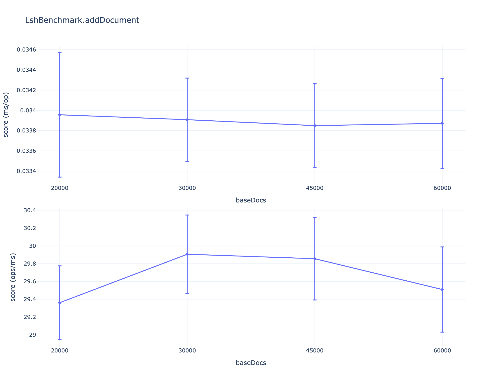

#### JMH Results
| baseDocs | avgt | thrpt |
|---|---:|---:|
| 20000 | 0.033956 +- 0.000616 ms/op | 29.361222 +- 0.413975 ops/ms |
| 30000 | 0.033908 +- 0.000411 ms/op | 29.905479 +- 0.440708 ops/ms |
| 45000 | 0.033850 +- 0.000416 ms/op | 29.855745 +- 0.463181 ops/ms |
| 60000 | 0.033872 +- 0.000444 ms/op | 29.509547 +- 0.477803 ops/ms |

#### Async Profiler Metrics by Params/Mode
| baseDocs | cpu_jvm_user_avg_pct | cpu_machine_total_avg_pct | cpu_samples_per_sec | alloc_events_per_sec | alloc_events_total | alloc_tlab_share_pct |
|---|---:|---:|---:|---:|---:|---:|
| 20000 | 15.002 | 27.796 | 148.609 | 1304.906 | 41757 | 100.000 |
| 30000 | 15.408 | 27.874 | 151.792 | 1299.972 | 46799 | 100.000 |
| 45000 | 15.657 | 28.177 | 153.333 | 1254.068 | 53283 | 100.000 |
| 60000 | 15.718 | 28.188 | 154.135 | 1251.796 | 61338 | 100.000 |

#### Notes
```text
Время добавления почти не зависит от числа документов, потому что операция состоит из вычисления шинглов, построения сигнатуры MinHash и добавления ключей в таблицы полос. Основная работа — вычисление сигнатуры длиной signatureSize, где для каждого шингла перебираются хеш-функции. Это видно в коде в методе signatureOf. Поэтому добавление одного документа имеет почти постоянную стоимость. Улучшить результат можно уменьшением длины сигнатуры или числа полос.
```

### buildIndex

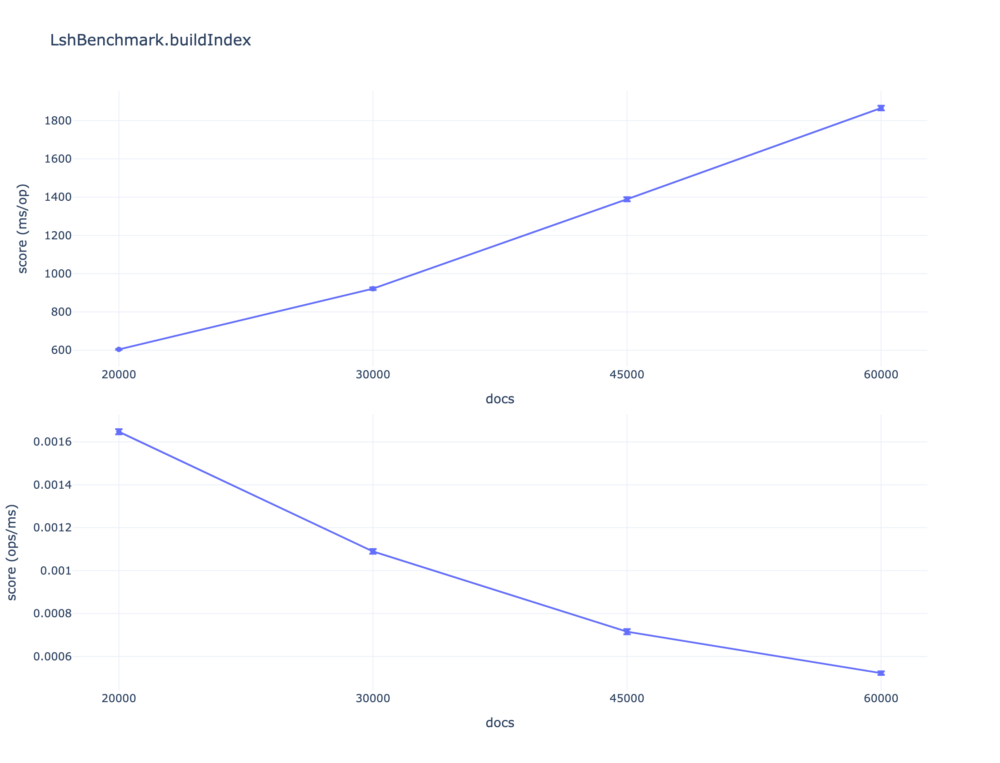

#### JMH Results
| docs | avgt | thrpt |
|---|---:|---:|
| 20000 | 603.911164 +- 2.240848 ms/op | 0.001647 +- 0.000012 ops/ms |
| 30000 | 921.148414 +- 6.928496 ms/op | 0.001089 +- 0.000011 ops/ms |
| 45000 | 1388.793982 +- 10.586246 ms/op | 0.000715 +- 0.000012 ops/ms |
| 60000 | 1865.458082 +- 12.257738 ms/op | 0.000522 +- 0.000008 ops/ms |

#### Async Profiler Metrics by Params/Mode
| docs | cpu_jvm_user_avg_pct | cpu_machine_total_avg_pct | cpu_samples_per_sec | alloc_events_per_sec | alloc_events_total | alloc_tlab_share_pct |
|---|---:|---:|---:|---:|---:|---:|
| 20000 | 10.332 | 22.983 | 104.517 | 1376.231 | 40580 | 100.000 |
| 30000 | 10.731 | 23.362 | 108.621 | 1389.742 | 45862 | 100.000 |
| 45000 | 11.251 | 23.756 | 114.100 | 1385.424 | 45719 | 100.000 |
| 60000 | 11.945 | 25.127 | 121.002 | 1343.681 | 59798 | 100.000 |

#### Notes
```text
График линейно растёт по количеству документов, что ожидаемо, так как индекс строится последовательным добавлением документов. Каждое добавление включает построение сигнатуры и обновление всех таблиц полос. Это приводит к линейной зависимости времени от размера набора данных. Улучшение возможно через параллельное вычисление сигнатур или уменьшение числа хеш-функций.
```

### candidatesQuery

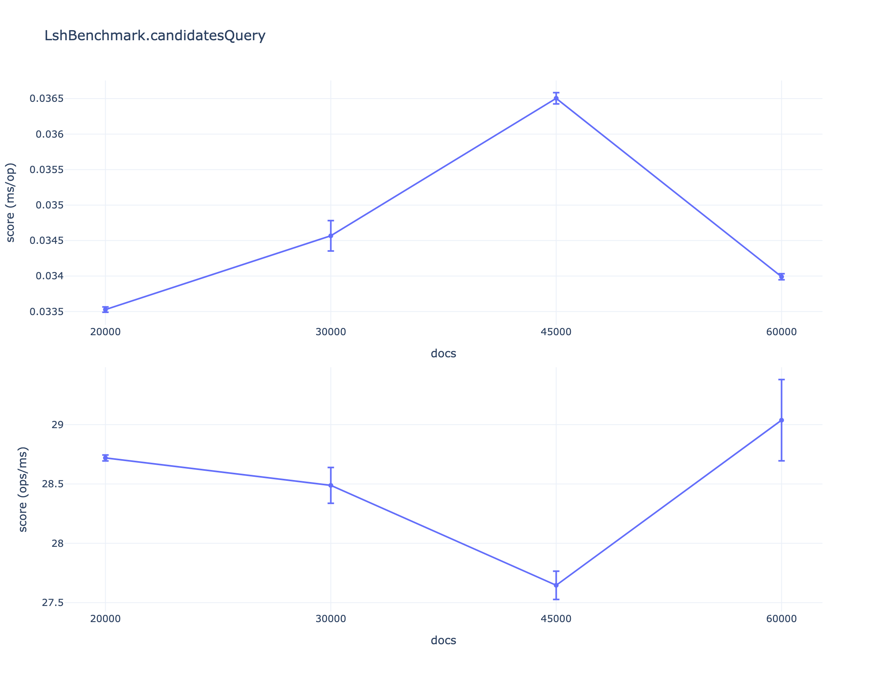

#### JMH Results
| docs | avgt | thrpt |
|---|---:|---:|
| 20000 | 0.033528 +- 0.000037 ms/op | 28.718896 +- 0.024824 ops/ms |
| 30000 | 0.034567 +- 0.000214 ms/op | 28.488087 +- 0.150856 ops/ms |
| 45000 | 0.036504 +- 0.000079 ms/op | 27.646188 +- 0.118916 ops/ms |
| 60000 | 0.033990 +- 0.000043 ms/op | 29.036988 +- 0.342531 ops/ms |

#### Async Profiler Metrics by Params/Mode
| docs | cpu_jvm_user_avg_pct | cpu_machine_total_avg_pct | cpu_samples_per_sec | alloc_events_per_sec | alloc_events_total | alloc_tlab_share_pct |
|---|---:|---:|---:|---:|---:|---:|
| 20000 | 9.998 | 22.787 | 102.438 | 1190.042 | 28561 | 100.000 |
| 30000 | 10.000 | 22.608 | 102.417 | 1186.312 | 28472 | 100.000 |
| 45000 | 10.002 | 22.854 | 102.771 | 1211.042 | 29065 | 100.000 |
| 60000 | 10.000 | 22.576 | 102.771 | 1333.250 | 31998 | 100.000 |

#### Notes
```text
Время запроса практически не зависит от числа документов, потому что алгоритм смотрит только бакеты в таблицах полос, соответствующие сигнатуре запроса. В коде это реализовано через вычисление сигнатуры и поиск по ключам полос в хеш-таблицах. Размер индекса влияет только на вероятность коллизий, но не на стоимость операции. Улучшение возможно за счёт уменьшения числа полос или оптимизации хеширования.
```

### nearDuplicatesFullScan

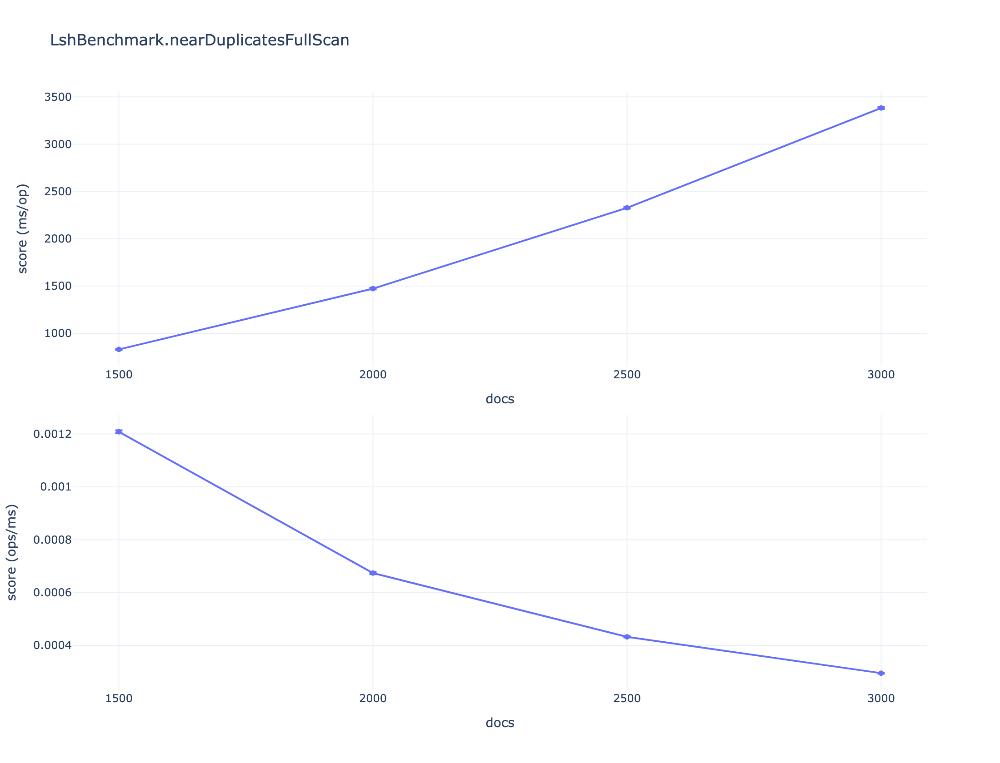

#### JMH Results
| docs | avgt | thrpt |
|---|---:|---:|
| 1500 | 829.657472 +- 6.640509 ms/op | 0.001208 +- 0.000005 ops/ms |
| 2000 | 1472.302194 +- 8.680679 ms/op | 0.000674 +- 0.000004 ops/ms |
| 2500 | 2327.187519 +- 9.810473 ms/op | 0.000432 +- 0.000002 ops/ms |
| 3000 | 3382.231604 +- 10.124210 ms/op | 0.000295 +- 0.000002 ops/ms |

#### Async Profiler Metrics by Params/Mode
| docs | cpu_jvm_user_avg_pct | cpu_machine_total_avg_pct | cpu_samples_per_sec | alloc_events_per_sec | alloc_events_total | alloc_tlab_share_pct |
|---|---:|---:|---:|---:|---:|---:|
| 1500 | 10.019 | 11.726 | 102.633 | 101.800 | 3054 | 100.000 |
| 2000 | 10.021 | 15.911 | 101.917 | 101.784 | 3766 | 100.000 |
| 2500 | 10.045 | 16.218 | 100.534 | 118.138 | 3426 | 100.000 |
| 3000 | 10.024 | 10.624 | 100.857 | 112.792 | 4680 | 100.000 |

#### Notes
```text
Время резко растёт с увеличением числа документов, что соответствует квадратичной сложности полного перебора пар. В коде используется двойной цикл по всем документам, поэтому количество сравнений растёт примерно как квадрат размера набора. Это ожидаемое поведение для полного перебора. Улучшить можно только заменой алгоритма на приближённый метод, например LSH.
```

### nearDuplicatesLsh

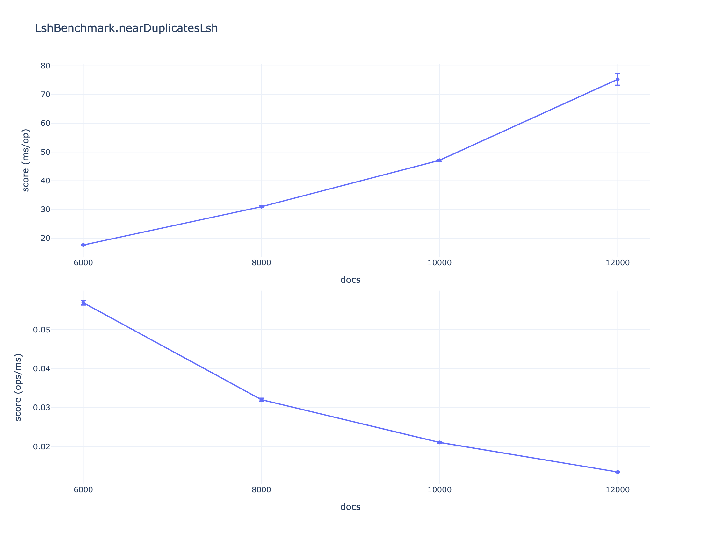

#### JMH Results
| docs | avgt | thrpt |
|---|---:|---:|
| 6000 | 17.623031 +- 0.112721 ms/op | 0.056896 +- 0.000582 ops/ms |
| 8000 | 30.951466 +- 0.314194 ms/op | 0.032036 +- 0.000367 ops/ms |
| 10000 | 47.113122 +- 0.380055 ms/op | 0.021080 +- 0.000182 ops/ms |
| 12000 | 75.297490 +- 2.074578 ms/op | 0.013493 +- 0.000109 ops/ms |

#### Async Profiler Metrics by Params/Mode
| docs | cpu_jvm_user_avg_pct | cpu_machine_total_avg_pct | cpu_samples_per_sec | alloc_events_per_sec | alloc_events_total | alloc_tlab_share_pct |
|---|---:|---:|---:|---:|---:|---:|
| 6000 | 10.358 | 11.022 | 108.000 | 644.250 | 16750 | 100.000 |
| 8000 | 10.459 | 11.262 | 108.333 | 620.537 | 16754 | 100.000 |
| 10000 | 10.588 | 11.292 | 109.768 | 627.554 | 17572 | 100.000 |
| 12000 | 12.200 | 12.900 | 125.707 | 613.966 | 17805 | 100.000 |

#### Notes
```text
В этом тесте время также растёт с увеличением числа документов, но значительно медленнее, чем при полном переборе. Это объясняется тем, что сравниваются только документы, попавшие в одинаковые полосы сигнатуры. В коде для каждой полосы перебираются только элементы одного бакета. Таким образом число проверок сильно меньше полного квадрата. Улучшение возможно через настройку числа полос и длины сигнатуры.
```

## PerfectHashingBenchmark

### buildIndex

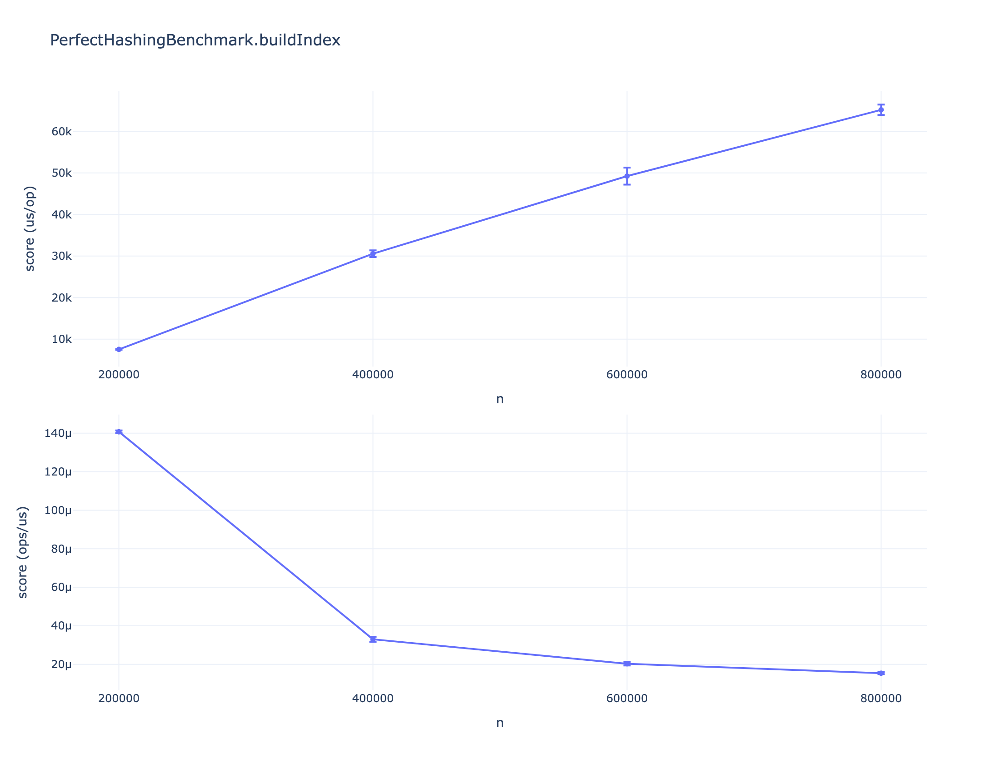

#### JMH Results
| n | avgt | thrpt |
|---|---:|---:|
| 200000 | 7528.056419 +- 72.727979 us/op | 0.000141 +- 0.000001 ops/us |
| 400000 | 30563.933880 +- 802.443504 us/op | 0.000033 +- 0.000001 ops/us |
| 600000 | 49239.756587 +- 2044.731816 us/op | 0.000020 +- 0.000001 ops/us |
| 800000 | 65186.598453 +- 1253.745752 us/op | 0.000015 +- 0.000001 ops/us |

#### Async Profiler Metrics by Params/Mode
| n | cpu_jvm_user_avg_pct | cpu_machine_total_avg_pct | cpu_samples_per_sec | alloc_events_per_sec | alloc_events_total | alloc_tlab_share_pct |
|---|---:|---:|---:|---:|---:|---:|
| 200000 | 10.887 | 11.596 | 108.604 | 9872.604 | 236942 | 100.000 |
| 400000 | 38.398 | 40.326 | 380.917 | 4424.378 | 108330 | 100.000 |
| 600000 | 37.114 | 39.343 | 348.602 | 4091.932 | 100244 | 100.000 |
| 800000 | 34.699 | 35.932 | 318.160 | 3891.340 | 97284 | 100.000 |

#### Notes
```text
График показывает почти линейный рост времени построения. Это ожидаемо, потому что структура строится в два этапа: сначала распределение ключей по бакетам, затем построение вторичных таблиц. В коде используется случайная хеш-функция, и если распределение слишком неравномерное, генерация повторяется. Это объясняет возможные скачки времени. Улучшение возможно использованием лучшей начальной хеш-функции.
```

### containsHit

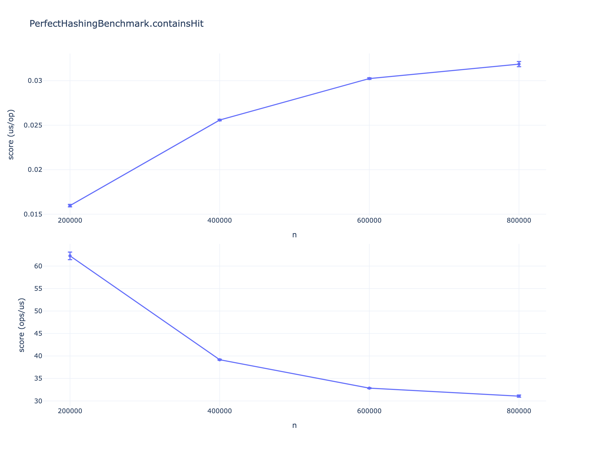

#### JMH Results
| n | avgt | thrpt |
|---|---:|---:|
| 200000 | 0.015964 +- 0.000140 us/op | 62.262031 +- 0.840798 ops/us |
| 400000 | 0.025578 +- 0.000082 us/op | 39.168844 +- 0.116487 ops/us |
| 600000 | 0.030238 +- 0.000092 us/op | 32.844851 +- 0.098266 ops/us |
| 800000 | 0.031859 +- 0.000289 us/op | 31.072326 +- 0.248926 ops/us |

#### Async Profiler Metrics by Params/Mode
| n | cpu_jvm_user_avg_pct | cpu_machine_total_avg_pct | cpu_samples_per_sec | alloc_events_per_sec | alloc_events_total | alloc_tlab_share_pct |
|---|---:|---:|---:|---:|---:|---:|
| 200000 | 9.998 | 10.788 | 102.375 | 0.021 | 0 | 100.000 |
| 400000 | 9.998 | 10.691 | 102.458 | 0.000 | 0 | - |
| 600000 | 10.000 | 10.661 | 102.500 | 0.021 | 0 | 100.000 |
| 800000 | 10.000 | 10.803 | 102.229 | 0.021 | 0 | 100.000 |

#### Notes
```text
Проверка существующего ключа работает почти за постоянное время. Алгоритм вычисляет бакет первого уровня, затем позицию во второй таблице. Это видно в методе containsKey, где выполняется всего одно вычисление хеша и одна проверка массива. Небольшой рост времени связан с влиянием кэш-памяти при увеличении структуры. Улучшить можно уменьшением размера вторичных таблиц.
```

### containsMiss

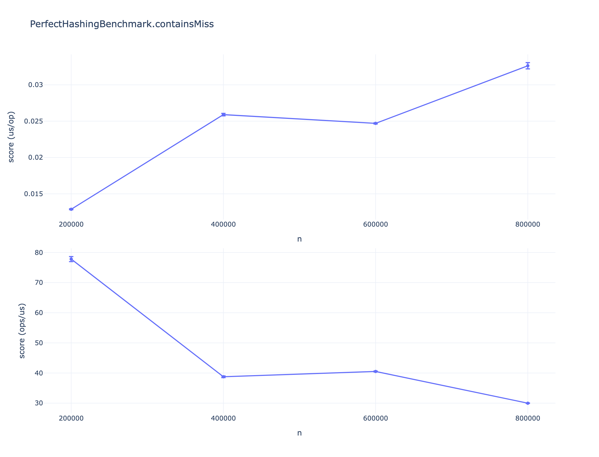

#### JMH Results
| n | avgt | thrpt |
|---|---:|---:|
| 200000 | 0.012872 +- 0.000067 us/op | 77.825521 +- 0.837210 ops/us |
| 400000 | 0.025903 +- 0.000176 us/op | 38.748007 +- 0.285064 ops/us |
| 600000 | 0.024698 +- 0.000078 us/op | 40.509423 +- 0.145377 ops/us |
| 800000 | 0.032627 +- 0.000429 us/op | 29.984632 +- 0.088425 ops/us |

#### Async Profiler Metrics by Params/Mode
| n | cpu_jvm_user_avg_pct | cpu_machine_total_avg_pct | cpu_samples_per_sec | alloc_events_per_sec | alloc_events_total | alloc_tlab_share_pct |
|---|---:|---:|---:|---:|---:|---:|
| 200000 | 9.998 | 10.768 | 102.146 | 0.021 | 0 | 100.000 |
| 400000 | 10.000 | 10.633 | 102.083 | 0.000 | 0 | - |
| 600000 | 10.002 | 10.732 | 102.396 | 0.021 | 0 | 100.000 |
| 800000 | 10.000 | 10.631 | 102.271 | 0.021 | 0 | 100.000 |

#### Notes
```text
Поведение аналогично предыдущему тесту, но иногда быстрее, потому что проверка может завершиться сразу после проверки флага занятости позиции. В коде используется массив used, который позволяет быстро определить отсутствие ключа. Разброс значений объясняется случайным распределением ключей по бакетам.
```

### getHit

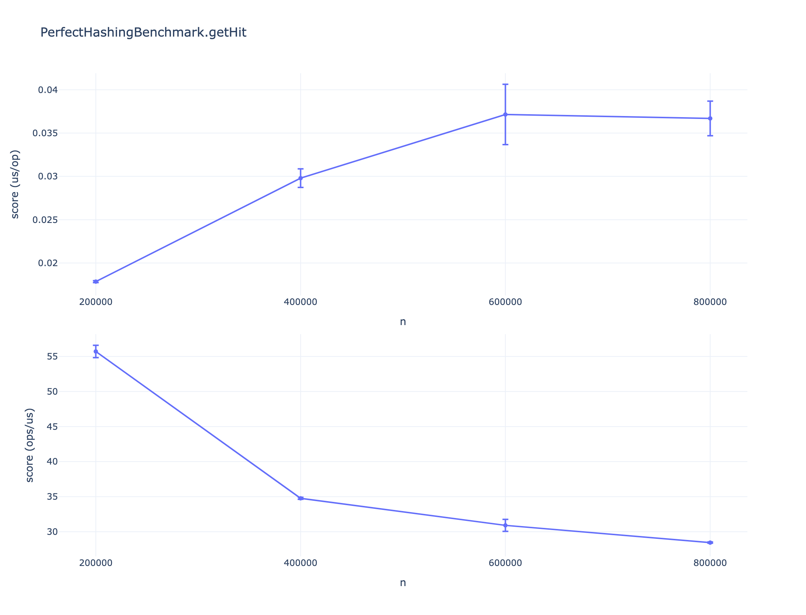

#### JMH Results
| n | avgt | thrpt |
|---|---:|---:|
| 200000 | 0.017851 +- 0.000108 us/op | 55.721461 +- 0.881500 ops/us |
| 400000 | 0.029795 +- 0.001072 us/op | 34.765237 +- 0.139935 ops/us |
| 600000 | 0.037144 +- 0.003481 us/op | 30.904773 +- 0.857514 ops/us |
| 800000 | 0.036690 +- 0.001994 us/op | 28.448563 +- 0.089899 ops/us |

#### Async Profiler Metrics by Params/Mode
| n | cpu_jvm_user_avg_pct | cpu_machine_total_avg_pct | cpu_samples_per_sec | alloc_events_per_sec | alloc_events_total |
|---|---:|---:|---:|---:|---:|
| 200000 | 10.000 | 10.738 | 102.438 | 0.000 | 0 |
| 400000 | 9.987 | 12.670 | 102.271 | 0.000 | 0 |
| 600000 | 9.127 | 13.181 | 51.657 | 0.000 | 0 |
| 800000 | 9.127 | 12.780 | 51.645 | 0.000 | 0 |

#### Notes
```text
Время доступа к существующему ключу также остаётся постоянным и зависит только от двух вычислений хеша и обращения к массиву. Метод get вычисляет бакет первого уровня и индекс во второй таблице. Это гарантирует O(1) доступ без коллизий. Небольшие колебания объясняются распределением ключей и влиянием кэша процессора.
```

### getMiss

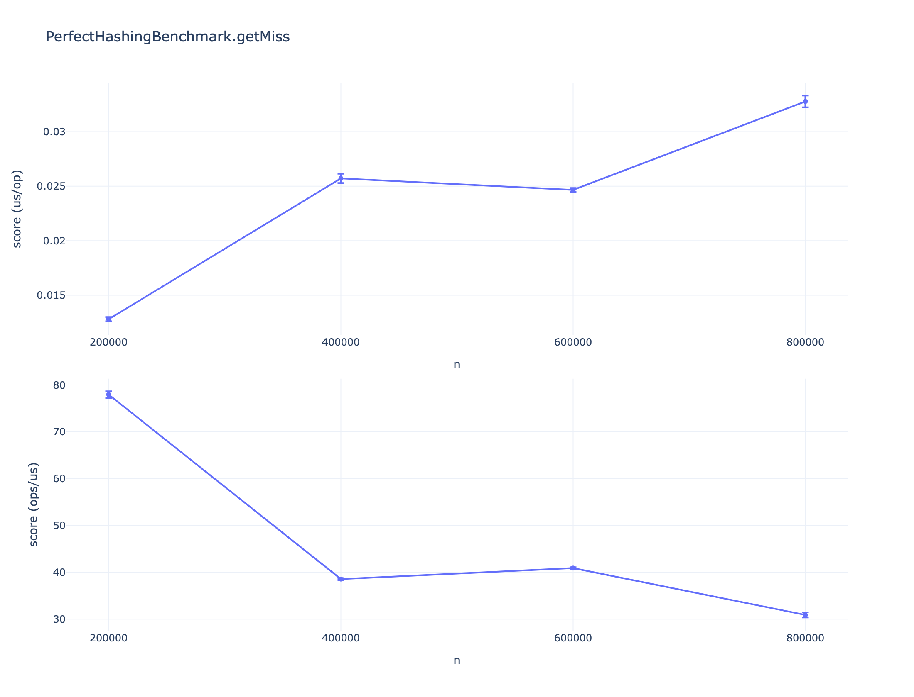

#### JMH Results
| n | avgt | thrpt |
|---|---:|---:|
| 200000 | 0.012801 +- 0.000196 us/op | 77.967476 +- 0.697687 ops/us |
| 400000 | 0.025715 +- 0.000428 us/op | 38.551408 +- 0.194212 ops/us |
| 600000 | 0.024661 +- 0.000169 us/op | 40.892855 +- 0.180070 ops/us |
| 800000 | 0.032775 +- 0.000540 us/op | 30.887215 +- 0.539291 ops/us |

#### Async Profiler Metrics by Params/Mode
| n | cpu_jvm_user_avg_pct | cpu_machine_total_avg_pct | cpu_samples_per_sec | alloc_events_per_sec | alloc_events_total |
|---|---:|---:|---:|---:|---:|
| 200000 | 10.000 | 11.679 | 101.604 | 0.000 | 0 |
| 400000 | 10.002 | 15.760 | 101.812 | 0.000 | 0 |
| 600000 | 10.004 | 16.367 | 102.333 | 0.000 | 0 |
| 800000 | 9.979 | 11.699 | 101.458 | 0.000 | 0 |

#### Notes
```text
Поведение аналогично containsMiss: операция выполняется за постоянное время, но иногда быстрее, чем успешный поиск, потому что проверка завершается после проверки флага занятости. Это ожидаемая динамика для идеальной хеш-таблицы. Улучшить производительность можно уменьшением размера вторичных таблиц или улучшением распределения ключей.
```

## Дополнительно

### PerfectHashingBenchmark.buildIndex

| n | secondaryTableSize (#) | primaryCollisions (#) |
|---|---:|---:|
| 200000 | 2136632480 | 427316240 |
| 400000 | 744386598 | 53593299 |
| 600000 | 1018975520 | 210987760 |
| 800000 | 870211490 | 133105745 |

#### Notes
```text
По этим цифрам видно, что качество построения первого уровня нестабильно и именно это потом раздувает суммарный размер вторичных таблиц. 
Суммарный размер второго уровня это сумма квадратов размеров бакетов `Σ n_j²`, а число коллизий первого уровня — сумма `(size(bucket) - 1)` по непустым бакетам.
Обе метрики собираются прямо в бенчмарке, а сама структура строится так, что сначала подбирается первая хеш-функция, затем для каждого бакета создаётся вторичная таблица размера `n_j²`. 
Поэтому аномалия `n = 200000`, где `secondaryTableSize = 2_136_632_480` это расширение примерно в **10683** раз относительно числа ключей, а число коллизий `427_316_240` вообще физически не похоже на корректную метрику для одного построения на 200 тысяч ключей. 
Для сравнения, при 400k, 600k и 800k значения уже выглядят на порядок разумнее, хотя и там качество распределения всё ещё скачет. 
Это наводит на две мысли. Первая: либо в дополнительных метриках есть ошибка агрегации или дублирование счётчиков на нескольких вызовах, потому что для одного построения коллизии первого уровня не могут быть настолько больше `n`; 
Вторая: даже если часть чисел реальна, всё равно слабое место именно в выборе первой хеш-функции и в цене построения вторичных таблиц. 
В коде сейчас критерий принятия первой функции очень мягкий: цикл останавливается, как только `Σ n_j² <= 4n`, после чего сразу строятся все вторичные таблицы . 
Самая полезная оптимизация здесь **искать не первую подходящую первую хеш-функцию, а лучшую из нескольких кандидатов**, например из 8 или 16 случайных вариантов выбирать ту, у которой минимальна `Σ n_j²` или хотя бы минимален максимальный бакет. Это даст выигрыш и по памяти, и по времени построения, потому что вторые уровни станут меньше и проще. 
Вторая идея **не создавать вторичную таблицу размера `n_j²` для бакетов размера 1 и 2 по общему правилу**: для одного ключа можно хранить его напрямую без отдельной большой схемы, для двух ключей можно использовать маленький специализированный контейнер. 
Также можно **убрать лишние промежуточные массивы** `keysByBucket`, `valuesByBucket`, `pos`, а потом для каждого бакета ещё раз массивы во втором уровне . 
```